# Diffusion Models

Artificial Intelligence, Generative Modeling. Needs: [[Multivariate Normal Distribution#Sampling a diagonal Gaussian]] for drawing a cloud, [[Multivariate Normal Distribution#Products and quotients of diagonal Gaussians]] for the arithmetic of composing, and [[NumPy#Broadcasting]] for noising many levels in one line.

> [!question] Test yourself
> [The diffusion models quiz](https://claude.ai/artifact/MyTdAaVfZW3wiqhbLKg4wu) covers [[#The forward process in one jump]] and [[#Composing models with a background]], including the paper's figures, in 22 questions. Your attempts are saved on the page.

> [!warning] Unfinished
> - One picture is still to be drawn: the deep-dive sheet for [[#Composing models with a background]], prompt 6 in the vault's `.prompts/Diffusion Models.md`. Its last render put the marked points off the note's saved figure, and it is stuck after three revisions.
> - The quiz page covers the toy only; the paper's figures added under [[#Composing models with a background]] are not in it yet.
> - Only two sections exist: the forward process and composition. The reverse process, the score and the training objective wait for a walk that reaches them.
> - No project has applied this yet. Every run below is a sandbox run.
>
> Stated, not checked: 1 claim, marked where it sits.

**A diffusion model learns to undo a fixed noising process, and two trained models can be combined by multiplying what each believes and dividing out what they share.** This note covers the noising, written as one jump from a clean point to any noise level, and the composition rule that the Mechanisms of Projective Composition paper names in its Definition 5.1. Both are worked on the same small two-dimensional Gaussian clouds, so every number can be checked by hand.

**Where you work.**

- Any terminal with Python 3, NumPy and Matplotlib. On the PC, that is Ubuntu under WSL, with the prepared environment `~/.vault-sandbox/bin/python`.
- A new empty folder. Nothing here touches a real project.

**Prepare the sandbox.**

```bash
mkdir -p ~/playground/sandbox/gaussian-clouds && cd ~/playground/sandbox/gaussian-clouds
~/.vault-sandbox/bin/python -c "import numpy; print(numpy.__version__)"
```

You should see a version number. This run printed `2.4.6`. If the environment is missing, [[Multivariate Normal Distribution#Try sampling yourself]] steps 1 and 2 say how to make it, or how to use `uv run` instead.

Both sections use the learner's `toy.py` and `samples.py`. Save them from [[Multivariate Normal Distribution#Try sampling yourself]], steps 3 and 5, into this folder.

## Table of contents

- [[#The forward process in one jump]]
- [[#Composing models with a background]]

## The forward process in one jump

Navigation: 📋 [[#Table of contents|TOC]] | [[#Composing models with a background]] ➡️

**The forward process noises a clean point $x_0$ to level $\bar\alpha$ in one step, $x_t = \sqrt{\bar\alpha}\,x_0 + \sqrt{1 - \bar\alpha}\,\varepsilon$ with $\varepsilon \sim \mathcal{N}(0, I)$, so a cloud $\mathcal{N}(\mu, \sigma^2)$ becomes $\mathcal{N}(\sqrt{\bar\alpha}\,\mu,\ \bar\alpha\,\sigma^2 + 1 - \bar\alpha)$.** $\bar\alpha = 1$ is the clean data, and $\bar\alpha$ near 0 is almost pure noise. *Cited:* Ho et al., equation (4).

### When to reach for the jump

When you need a cloud at a given noise level without running every small step before it: to make training pairs, to see what a noise level does to two experts before composing them, or to check a toy against the closed form. The paper composes the experts after noising, at every level, so knowing what each level does to a cloud comes first.

### The form of the jump

```text
abar = np.array([<level 1>, <level 2>, ...])                    shape (L,); 1 is clean, near 0 is noise
a    = abar[:, None, None]                                       shape (L, 1, 1), one number per level
xt   = np.sqrt(a) * x0 + np.sqrt(1 - a) * rng.standard_normal((L, N, 2))     shape (L, N, 2)
mean: np.sqrt(level) * mu        variance: level * var + 1 - level            the closed form, per level
```

Both factors are square roots. They make the two parts' variances, $\bar\alpha$ and $1 - \bar\alpha$, add to 1 for unit-variance data.

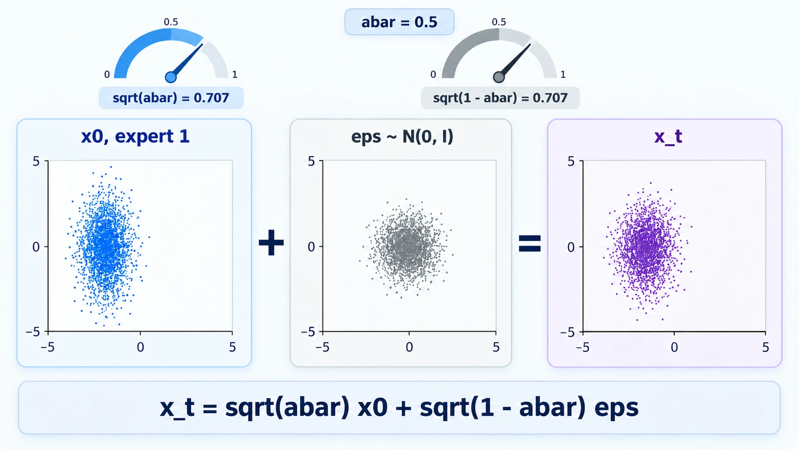

*The form, one clean cloud and one noise cloud mixed by the two square-root dials into the noised cloud.*

### Try the jump yourself

**1. What you need, and when it is missing.** As in the sandbox preparation above.

**2. Make something to act on.** `toy.py` and `samples.py` in `~/playground/sandbox/gaussian-clouds`, as above. The cloud is expert 1, $\mathcal{N}((-2, 0), \operatorname{diag}(1, 4))$.

**3. The failure: the weights without their square roots.** Save this as `wrong_scale.py`:

```python
import numpy as np
from toy import shared
from samples import sample, rng, N

mu, var = shared[1]
x0 = sample(mu, var, N)
a = 0.5
xt = a * x0 + (1 - a) * rng.standard_normal((N, 2))
print("no square roots, level 0.5: var", np.round(xt.var(0), 2).tolist(), "| closed form", (a * var + 1 - a).tolist())
```

```bash
~/.vault-sandbox/bin/python wrong_scale.py
```

```text
no square roots, level 0.5: var [0.5, 1.25] | closed form [1.0, 2.5]
```

Without the square roots, each part's variance is multiplied by the square of its weight, $0.25$, and the cloud shrinks to half the variance the closed form says.

**4. The technique.** Save this as `noised.py`. It noises one cloud at three levels in one tensor and prints the closed form beside each measured level:

```python
import numpy as np
from toy import shared
from samples import sample, rng, N

mu, var = shared[1]
x0 = sample(mu, var, N)
abar = np.array([1.0, 0.5, 0.0058])
a = abar[:, None, None]
xt = np.sqrt(a) * x0 + np.sqrt(1 - a) * rng.standard_normal((3, N, 2))
print(xt.shape)
for index, level in enumerate(abar):
    print("level", level, "measured", np.round(xt[index].mean(0), 2).tolist(), np.round(xt[index].var(0), 2).tolist(),
          "| closed form", np.round(np.sqrt(level) * mu, 2).tolist(), np.round(level * var + 1 - level, 2).tolist())
```

```bash
~/.vault-sandbox/bin/python noised.py
```

You should see:

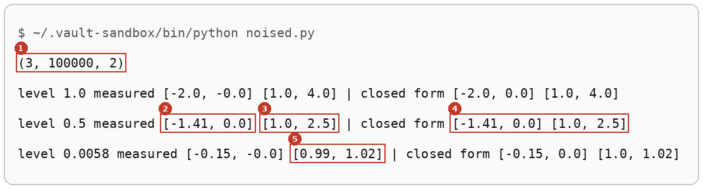

Every measured pair sits within 0.01 of the closed form. Nothing else is printed before the shape line, because `samples.py` keeps its own print loop under `if __name__ == "__main__":`. Without that line, the import prints the three clouds first: see [[Modules And Imports#Try it yourself]] step 6.

**5. Another way to get the same answer: many small steps.** The jump stands in for a chain of small steps $x_s = \sqrt{\alpha_s}\,x_{s-1} + \sqrt{1 - \alpha_s}\,\varepsilon_s$, with $\bar\alpha$ the product of the $\alpha_s$. Save this as `stepwise.py`; its four $\alpha$ values are plan 09's:

```python
import numpy as np

rng = np.random.default_rng(1)
alphas = np.array([0.9, 0.8, 0.95, 0.7])
x0 = np.full(200_000, 2.0)
x = x0.copy()
for a in alphas:
    x = np.sqrt(a) * x + np.sqrt(1 - a) * rng.standard_normal(x.shape)
abar = np.prod(alphas)
jump = np.sqrt(abar) * x0 + np.sqrt(1 - abar) * rng.standard_normal(x0.shape)
print("abar", round(float(abar), 4))
print("four steps: mean", round(float(x.mean()), 3), "var", round(float(x.var()), 3))
print("one jump:   mean", round(float(jump.mean()), 3), "var", round(float(jump.var()), 3))
print("closed form: mean", round(float(np.sqrt(abar) * 2.0), 3), "var", round(float(1 - abar), 3))
```

```bash
~/.vault-sandbox/bin/python stepwise.py
```

```text
abar 0.4788
four steps: mean 1.383 var 0.521
one jump:   mean 1.386 var 0.519
closed form: mean 1.384 var 0.521
```

Four steps and one jump land on the same distribution. Why they must is plan 09's derivation, section 3, worked there on paper.

**6. Clean up, and prove it.** Keep the folder if you are going on to [[#Try composing yourself]]. Otherwise:

```bash
cd ~ && rm -r ~/playground/sandbox/gaussian-clouds
ls ~/playground/sandbox/gaussian-clouds; echo $?
```

You should see `No such file or directory`, then `2`.

### Reading the noised output

From step 4:

| # | Field | This run | How to read it | Backing |
|---|---|---|---|---|
| 1 | shape | `(3, 100000, 2)` | three levels, each a full cloud of 100,000 points in two coordinates | shown |
| 2 | level 0.5, measured mean | `[-1.41, 0.0]` | the cloud's centre moved toward 0 by $\sqrt{0.5} = 0.707$ | derived below |
| 3 | level 0.5, measured variance | `[1.0, 2.5]` | the narrow axis stayed at 1, the wide axis shrank from 4 toward 1 | derived below |
| 4 | level 0.5, closed form | `[-1.41, 0.0] [1.0, 2.5]` | $\sqrt{\bar\alpha}\,\mu$ and $\bar\alpha\,\sigma^2 + 1 - \bar\alpha$; equal to fields 2 and 3 | derived below |
| 5 | level 0.0058, measured variance | `[0.99, 1.02]` | almost pure noise: both axes close to 1, whatever the cloud was | derived below |

### How the jump works

One coordinate at a time, with $x_0 \sim \mathcal{N}(m, v)$ and $\varepsilon \sim \mathcal{N}(0, 1)$ independent of it:

$$
\begin{aligned}
x_t &= \sqrt{\bar\alpha}\,x_0 + \sqrt{1 - \bar\alpha}\,\varepsilon \\
\mathbb{E}[x_t] &= \sqrt{\bar\alpha}\,\mathbb{E}[x_0] + \sqrt{1 - \bar\alpha}\,\mathbb{E}[\varepsilon] = \sqrt{\bar\alpha}\,m \\
\operatorname{Var}[x_t] &= \bar\alpha \operatorname{Var}[x_0] + (1 - \bar\alpha) \operatorname{Var}[\varepsilon] = \bar\alpha\,v + 1 - \bar\alpha
\end{aligned}
$$

The variances add because $x_0$ and $\varepsilon$ are independent, and each is multiplied by the square of its weight. Without the square roots, step 3's weights $0.5$ and $0.5$ give $0.25\,v + 0.25$ instead: $0.5$ and $1.25$, as it printed.

The worked numbers for expert 1, $m = (-2, 0)$ and $v = (1, 4)$:

$$
\begin{aligned}
\bar\alpha = 0.5: \quad & \text{mean } \sqrt{0.5} \times (-2) = -1.414, & \text{variance } & 0.5 \times 1 + 0.5 = 1.0, \quad 0.5 \times 4 + 0.5 = 2.5 \\
\bar\alpha = 0.0058: \quad & \text{mean } \sqrt{0.0058} \times (-2) = -0.152, & \text{variance } & 0.0058 \times 1 + 0.9942 = 1.0, \quad 0.0058 \times 4 + 0.9942 = 1.017
\end{aligned}
$$

The narrow axis has variance 1 at every level, because noise of variance 1 replaces signal of variance 1. For the step-by-step chain, $\bar\alpha = 0.9 \times 0.8 \times 0.95 \times 0.7 = 0.4788$, and the closed form gives mean $\sqrt{0.4788} \times 2 = 1.384$ and variance $1 - 0.4788 = 0.521$, as step 5 printed.

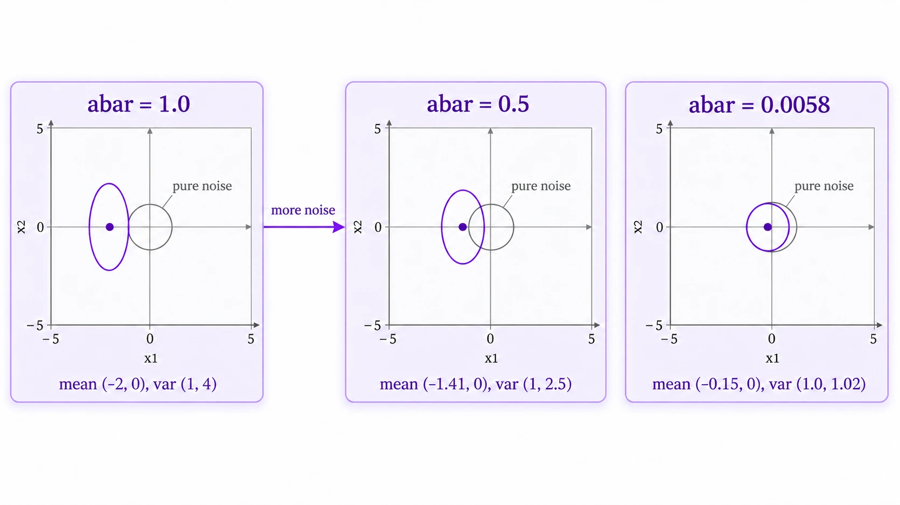

*The mechanism, expert 1's cloud at the three levels, its centre sliding toward 0 and its two axes heading toward variance 1.*

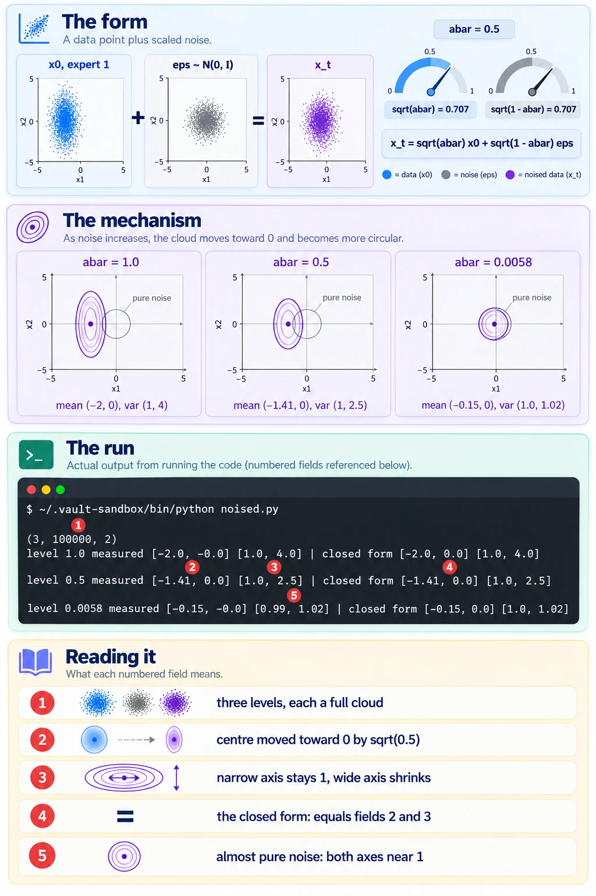

*The deep-dive sheet composing the form, the mechanism and the run.*

### Other ways to noise

- **The step-by-step chain**, as in step 5, when the intermediate states matter, as in a sampler that walks back down. One jump is the shortcut when only the end state is needed.
- **A noise scale without the shrink**, $x_t = x_0 + \sigma_t\,\varepsilon$, the variance-exploding form the paper's Appendix K uses. Its $\sigma_t$ corresponds to $\sqrt{1 - \bar\alpha}$ here, and the clean part is not scaled down. *Cited:* the walk's notation table, from the paper's Appendix K.

### Why the jump matters

Training a diffusion model needs pairs of clean and noised points at random levels, and the jump makes each pair in one line. The paper's composition result holds at every noise level, so the clouds being composed in the next section are noised clouds, and this closed form says what they look like.

### The jump taught in, applied in

**Taught in:**

- the `drip-read` walk of [the Mechanisms of Projective Composition paper note](../../deep-learning/01-poe-derivation-foundations/papers/mechanisms-of-projective-composition/), step 3c, where the learner's `noised.py` printed level 0.5 as mean `[-1.41, -0]` and variance `[1, 2.51]`, within 0.05 of the closed form, with the closed-form print still owed
- the PoE derivation foundations journey's plan 09, `plans/09-the-forward-process.md`, task 1 at lines 138 to 168 (iterate the steps, then jump, and compare) and section 3 at lines 221 to 277 (derive the jump on paper)

**Applied in:** nothing yet.

**Before this note:** the learner's LibreOffice note `Artificial Intelligence/Machine Learning/Generative Models/Diffusion Models/Diffusion Models.odt` describes the forward process as a fixed Markov chain that adds Gaussian noise over $T = 1000$ steps and writes the single step $q(x_t \mid x_{t-1}) = \mathcal{N}(\sqrt{\alpha_t}\,x_{t-1}, (1 - \alpha_t) I)$, without the one-jump form.

## Composing models with a background

Navigation: ⬅️ [[#The forward process in one jump]] | 📋 [[#Table of contents|TOC]]

**Definition 5.1 of the Mechanisms of Projective Composition paper composes experts by multiplying them and dividing out the background once for each expert, $\mathcal{C}[p_b, p_1, p_2](x) = \frac{1}{Z}\,p_b(x)\,\frac{p_1(x)}{p_b(x)}\,\frac{p_2(x)}{p_b(x)}$, so each expert counts only where it differs from the background.** In score form, which is what a diffusion sampler adds, $\nabla \log \mathcal{C} = \nabla \log p_1 + \nabla \log p_2 - \nabla \log p_b$. *Cited:* the paper, equations (5) and (6).

### Words this uses

**Background**, $p_b$. The distribution of scenes with nothing in them: in the paper's images, an empty wall. In the toy below it is the wide round cloud $\mathcal{N}((0, 0), \operatorname{diag}(4, 4))$.

**Expert**, $p_i$. One model's distribution: scenes that contain object $i$. Where object $i$ is absent, an expert looks like the background.

**Co-occurrence.** Both objects in one scene, each in its own place. This is the composition you want.

**Hybrid.** One object that is a blend of both, at a value neither expert put there. This is the failure.

### The two-pixel picture

Treat each point $(x_0, x_1)$ as a tiny image with two pixels: $x_0$ is the left half of the scene and $x_1$ the right half. The paper's appendix maps coordinates to pixel regions the same way, with a mask $M_i$ around each object's location. *Cited:* the paper, Definition 5.2.

| Cloud | Mean | Variance | What it is in the scene |
|---|---|---|---|
| background $p_b$ | $(0, 0)$ | $(4, 4)$ | the empty wall |
| expert 1 | $(-2, 0)$ | $(1, 4)$ | an object in the left half: $x_0$ moves to $-2$, and $x_1$ stays exactly like the wall |
| expert 2, split | $(0, 2)$ | $(4, 1)$ | an object in the right half: $x_1$ moves to $2$, and $x_0$ stays like the wall |
| expert 2, shared | $(2, 0)$ | $(4, 1)$ | a different object in the left half: $x_0$ moves to $+2$. It also narrows the right half from variance 4 to 1, with its mean still 0, so it is not purely a left-half object |

In split, the experts want different pixels. In shared, both want the left pixel, one at $-2$ and the other at $+2$.

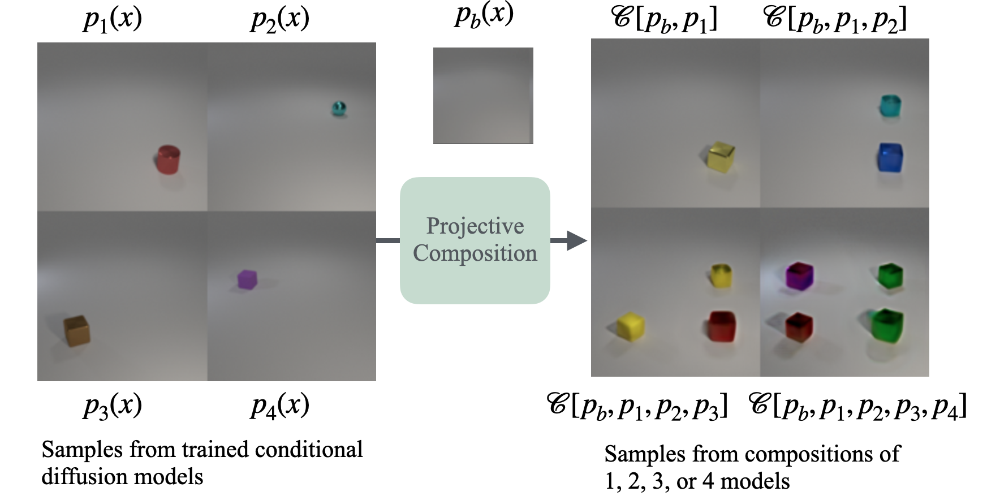

> **Figure 2.** Length-generalization, another capability of composition enabled by our framework. Diffusion models trained to generate a single object conditioned on location (left) can be composed at inference-time to generate images of multiple objects at specified locations (right). Notably, such images are strictly out-of-distribution for the individual models being composed. (Additional samples in Figure 10.)
>
> *Bradley et al., Mechanisms of Projective Composition of Diffusion Models, ICML 2025, [arXiv 2502.04549](https://arxiv.org/abs/2502.04549), Figure 2. arXiv non-exclusive distribution licence; copied for study with citation.*

This is split at image scale: each model $p_i$ moves only the patch where its object sits and leaves the rest of the floor like the empty background $p_b$, so composing them puts every object in one scene, as the toy's split puts $-2$ in the left half and $2$ in the right. *Shown* in the figure, with the caption.

### Why the background is divided out

On a half it does not care about, an expert repeats the wall. Multiply two experts and the wall's opinion of that half is counted twice. Dividing by $p_b$ once removes the extra copy. In split's right half, expert 1 is $\mathcal{N}(0, 4)$, identical to the wall, so $p_1 / p_b = 1$ there and only expert 2 decides: the composed right half is $\mathcal{N}(2, 1)$. Left in, the extra copy of the wall pulls it to $1.6$.

### When to reach for the composition rule

When two conditions should both appear in one sample: a cat and a dog, a red cube and a blue sphere. A diffusion sampler adds the two conditional scores and subtracts the unconditional one, and Definition 5.1 says which distribution that sum is the score of. The rule gives co-occurrence when each expert owns its own pixels and differs from the background only there (split). When two experts want the same pixels (shared), it returns a hybrid.

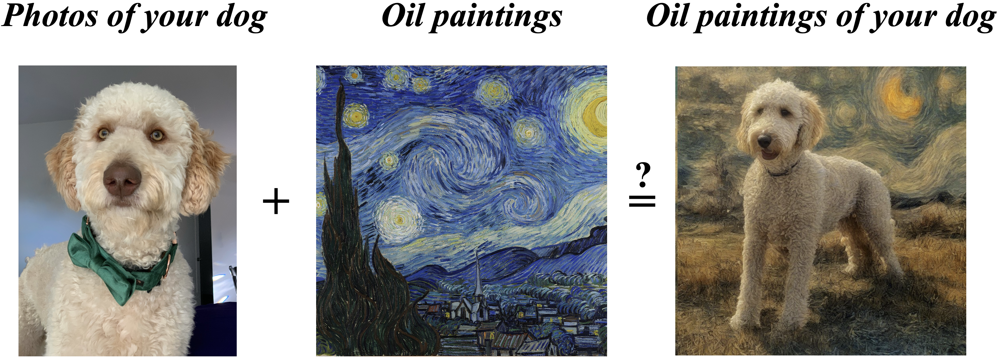

> **Figure 1.** Composing diffusion models via score combination. Given two diffusion models, it is sometimes possible to sample in a way that composes content from one model (e.g. your dog) with style of another model (e.g. oil paintings). We aim to theoretically understand this empirical behavior. Figure generated via score composition with SDXL fine-tuned on the author's dog; details in Appendix C.
>
> *Bradley et al., Mechanisms of Projective Composition of Diffusion Models, ICML 2025, [arXiv 2502.04549](https://arxiv.org/abs/2502.04549), Figure 1. arXiv non-exclusive distribution licence; copied for study with citation.*

The everyday use of the rule: one model supplies what is in the picture, the other how it is painted. The caption's "sometimes" is the question this section answers, and Figure 8 under [[#Why composition matters]] is the paper's guess at when. *Cited:* the caption.

### The form of a composition

```text
C[p_b, p_1, ..., p_k](x) = (1/Z) * p_b(x) * prod_i ( p_i(x) / p_b(x) )     the composed density
grad log C = sum_i grad log p_i  -  (k - 1) * grad log p_b                  the compositional score
for two experts:  C = p_1 * p_2 / p_b                                       one background divided out
```

For diagonal Gaussians, `p_1 * p_2 / p_b` is computed one coordinate at a time by adding and subtracting precisions, as in [[Multivariate Normal Distribution#Products and quotients of diagonal Gaussians]].

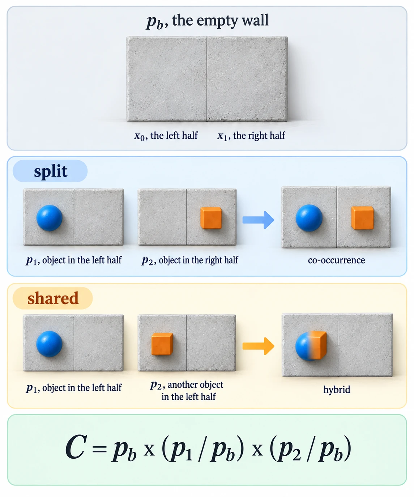

*The form, the two-pixel scene as a wall with an object in each half, and the rule multiplying the two experts and dividing out one wall.*

### Try composing yourself

**1. What you need, and when it is missing.** As in the sandbox preparation above, with Matplotlib.

**2. Make something to act on.** `toy.py` in `~/playground/sandbox/gaussian-clouds`. Its `shared` and `split` lists hold the four clouds of [[#The two-pixel picture]].

**3. Look at it before.** The experts as clouds, shared beside split, are drawn in [[Multivariate Normal Distribution#Try sampling yourself]] step 7. Before plotting, the walk asked where expert 1 and expert 2 overlap. The learner predicted "blue and orange overlap more around the origin, and the origin is the centre of the overlap". The answer key's run, in [[Multivariate Normal Distribution#Try composing yourself]] step 3, puts the overlap at $(-1.2, 0)$ for shared and $(-1.6, 1.6)$ for split, with no background in the product.

**4. The failure, and the technique, in one picture.** Save this as `picture.py`. For each version it draws the wall in grey, expert 1 in blue and expert 2 in orange, each as the contour at 30% of its peak height. It marks the plain product $p_1 p_2$ with a purple cross and the composition $p_1 p_2 / p_b$ with a green dot and a green filled contour:

```python
import numpy as np, matplotlib
matplotlib.use("Agg")
import matplotlib.pyplot as plt
from toy import shared, split

g = np.linspace(-7, 7, 401)
X0, X1 = np.meshgrid(g, g)

def dens(m, v):
    return np.exp(-(X0 - m[0])**2 / (2 * v[0]) - (X1 - m[1])**2 / (2 * v[1]))

fig, axes = plt.subplots(1, 2, figsize=(11, 5.4), sharex=True, sharey=True)
for ax, (title, ps) in zip(axes, [("split: expert 2 owns the right half", split), ("shared: both experts want the left half", shared)]):
    (mb, vb), (m1, v1), (m2, v2) = ps
    P = 1 / v1 + 1 / v2 - 1 / vb
    m = (m1 / v1 + m2 / v2 - mb / vb) / P
    Pn = 1 / v1 + 1 / v2
    mn = (m1 / v1 + m2 / v2) / Pn
    ax.contour(X0, X1, dens(mb, vb), levels=[0.3], colors="0.6")
    ax.contour(X0, X1, dens(m1, v1), levels=[0.3], colors="tab:blue")
    ax.contour(X0, X1, dens(m2, v2), levels=[0.3], colors="tab:orange")
    ax.contourf(X0, X1, dens(m, 1 / P), levels=[0.3, 1.01], colors="tab:green", alpha=0.35)
    ax.plot(*m, "o", c="tab:green", ms=8)
    ax.plot(*mn, "x", c="tab:purple", ms=10, mew=2)
    ax.annotate(f"p1 p2 / p_b: ({m[0]:.1f}, {m[1]:.1f})", m, (-6.6, 5.6), color="tab:green", fontsize=11,
                arrowprops=dict(arrowstyle="->", color="tab:green"))
    ax.annotate(f"p1 p2, wall counted twice: ({mn[0]:.1f}, {mn[1]:.1f})", mn, (-6.6, -5.6), color="tab:purple", fontsize=11,
                arrowprops=dict(arrowstyle="->", color="tab:purple"))
    ax.text(2.3, -2.9, "p_b, the wall", color="0.45")
    ax.text(-3.6, -3.6, "p_1", color="tab:blue", fontsize=11)
    ax.text(*((3.6, 3.4) if m2[1] > 0 else (4.2, -1.4)), "p_2", color="tab:orange", fontsize=11)
    ax.axhline(0, c="0.85", lw=0.8); ax.axvline(0, c="0.85", lw=0.8)
    ax.set(title=title, xlim=(-7, 7), ylim=(-7, 7), aspect="equal", xlabel="x0, the left half", ylabel="x1, the right half")
fig.tight_layout()
fig.savefig("composition-split-and-shared.png", dpi=110)
print("saved composition-split-and-shared.png")
```

```bash
~/.vault-sandbox/bin/python picture.py
```

```text
saved composition-split-and-shared.png
```

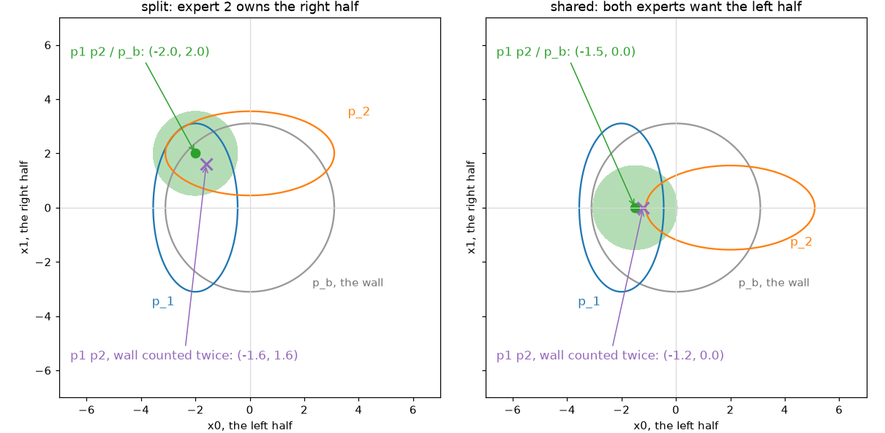

On the left, split: the green dot sits at $(-2, 2)$, expert 1's left value and expert 2's right value together. That is co-occurrence. The purple cross at $(-1.6, 1.6)$ is the product with the wall left in, pulled 0.4 toward the middle on both halves. On the right, shared: the green dot sits at $(-1.5, 0)$. The left half is $-1.5$, a value neither expert wanted, so the result is a hybrid, and dividing out the wall does not rescue it.

**5. Another way to get the same answer.** `compose.py` in [[Multivariate Normal Distribution#Try composing yourself]] step 5 prints the same four centres by precisions, and `grid_check.py` in step 6 there finds them without any formula.

**6. Clean up, and prove it.**

```bash
cd ~ && rm -r ~/playground/sandbox/gaussian-clouds
ls ~/playground/sandbox/gaussian-clouds; echo $?
```

You should see `No such file or directory`, then `2`.

### Reading the composition picture

| # | Mark | This run | How to read it | Backing |
|---|---|---|---|---|
| 1 | split, green dot | $(-2.0, 2.0)$ | each half took its own expert's value: co-occurrence | derived below |
| 2 | split, purple cross | $(-1.6, 1.6)$ | the plain product: the wall, counted twice, pulls both halves 20% toward 0 | derived below |
| 3 | shared, green dot | $(-1.5, 0.0)$ | the left half lands between $-2$ and $+2$: a hybrid | derived below |
| 4 | shared, purple cross | $(-1.2, 0.0)$ | the plain product, pulled further toward 0 | derived below |
| 5 | green filled contour | variance 1 on each axis | the composed cloud is round in both versions | derived below |

### How composition works

Per coordinate, with precision $P = 1/v_1 + 1/v_2 - 1/v_b$ and $B = m_1/v_1 + m_2/v_2 - m_b/v_b$, the composed mean is $B/P$ and the variance $1/P$. The derivation, step by step, is [[Multivariate Normal Distribution#How the product works]]. The four halves of the toy:

$$
\begin{aligned}
\text{split, left: } & P = \tfrac{1}{1} + \tfrac{1}{4} - \tfrac{1}{4} = 1, & B &= \tfrac{-2}{1} + \tfrac{0}{4} - 0 = -2, & \text{mean } -2 \\
\text{split, right: } & P = \tfrac{1}{4} + \tfrac{1}{1} - \tfrac{1}{4} = 1, & B &= \tfrac{0}{4} + \tfrac{2}{1} - 0 = 2, & \text{mean } 2 \\
\text{shared, left: } & P = \tfrac{1}{1} + \tfrac{1}{4} - \tfrac{1}{4} = 1, & B &= \tfrac{-2}{1} + \tfrac{2}{4} - 0 = -1.5, & \text{mean } -1.5 \\
\text{shared, right: } & P = \tfrac{1}{4} + \tfrac{1}{1} - \tfrac{1}{4} = 1, & B &= \tfrac{0}{4} + \tfrac{0}{1} - 0 = 0, & \text{mean } 0
\end{aligned}
$$

In every half where one expert equals the wall, that expert's precision cancels the wall's, and the other expert decides alone. Shared's right half is $\mathcal{N}(0, 1)$: expert 2 narrowed it. Shared's left half is the one place where neither expert equals the wall, so both pull, weighted by their precisions 1 and $\frac{1}{4}$, and the mean lands at $-1.5$.

With the wall left in, drop the $-\frac{1}{4}$ terms: $P = 1.25$ on every half, and split's right half becomes $2 / 1.25 = 1.6$.

This toy is the paper's simplest setting, where each expert's projection is a coordinate restriction. Its Theorem 5.3 states the condition under which the composition is correct and can be sampled by reverse diffusion. *Cited:* the walk's read-ahead, `read-ahead/05-simple-construction.md`, chunks 47 to 49. The walk reaches it later; this section shows only the composed density.

The paper calls a composition correct when it is projective: seen through each expert's own window, the result looks exactly like that expert.

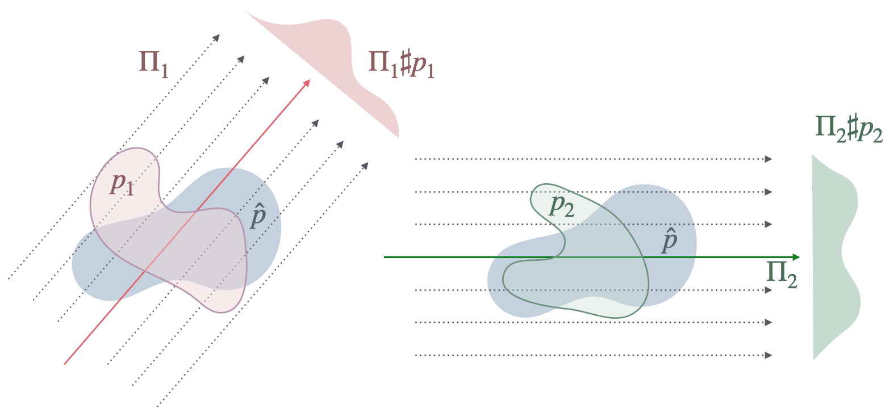

> **Figure 4.** Distribution $\hat{p}$ is a projective composition of $p_1$ and $p_2$ w.r.t. projection functions $(\Pi_1, \Pi_2)$, because $\hat{p}$ has the same marginals as $p_1$ when both are post-processed by $\Pi_1$, and analogously for $p_2$.
>
> *Bradley et al., Mechanisms of Projective Composition of Diffusion Models, ICML 2025, [arXiv 2502.04549](https://arxiv.org/abs/2502.04549), Figure 4. arXiv non-exclusive distribution licence; copied for study with citation.*

In the toy, $\Pi_1$ keeps $x_0$ and $\Pi_2$ keeps $x_1$. Split passes the test: the composed left half is $\mathcal{N}(-2, 1)$, the same as expert 1's left half, and the composed right half is $\mathcal{N}(2, 1)$, the same as expert 2's right half. Shared fails it: its composed left half, $\mathcal{N}(-1.5, 1)$, matches neither expert 1's $\mathcal{N}(-2, 1)$ nor expert 2's $\mathcal{N}(2, 4)$. *Derived* from the four halves above.

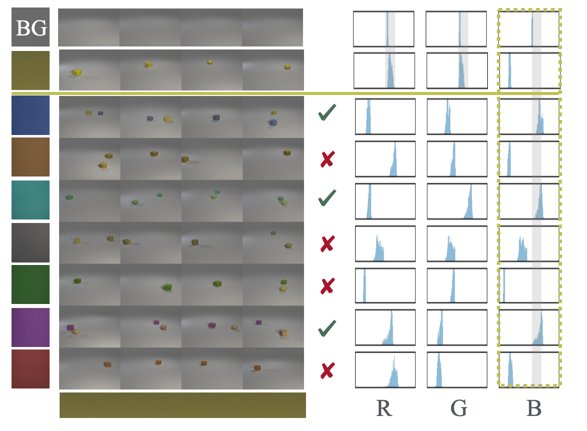

> **Figure 5.** **Composing yellow objects with objects of other colors.** Yellow objects successfully compose with blue, cyan and magenta objects but not with brown, gray, green, or red objects. Per the histograms (left), in RGB-colorspace yellow has R, G distributed like the background (gray) while B has a distinct distribution peaked closer to zero. Taking $M_\text{yellow} \approx \{B\}$, Theorem 5.3 predicts that standard diffusion can sample from compositions of yellow with any color where the B channel is distributed like the background: namely, blue, cyan, magenta per the histograms. (Other colors may theoretically compose per Theorem 6.1, but be difficult to sample.) (Additional samples in Figure 11.)
>
> *Bradley et al., Mechanisms of Projective Composition of Diffusion Models, ICML 2025, [arXiv 2502.04549](https://arxiv.org/abs/2502.04549), Figure 5. arXiv non-exclusive distribution licence; copied for study with citation.*

The same test on colour channels in place of pixels. Yellow differs from the grey background only in its B channel, the way expert 1 differs from the wall only in $x_0$. Blue, cyan and magenta keep B like the background, which is split, and they compose (ticks). Brown, gray, green and red move B too, which is shared, and their samples mostly hold a single object (crosses). The histograms sit on the right of the picture, although the caption says left. *Shown* in the figure, with the caption.

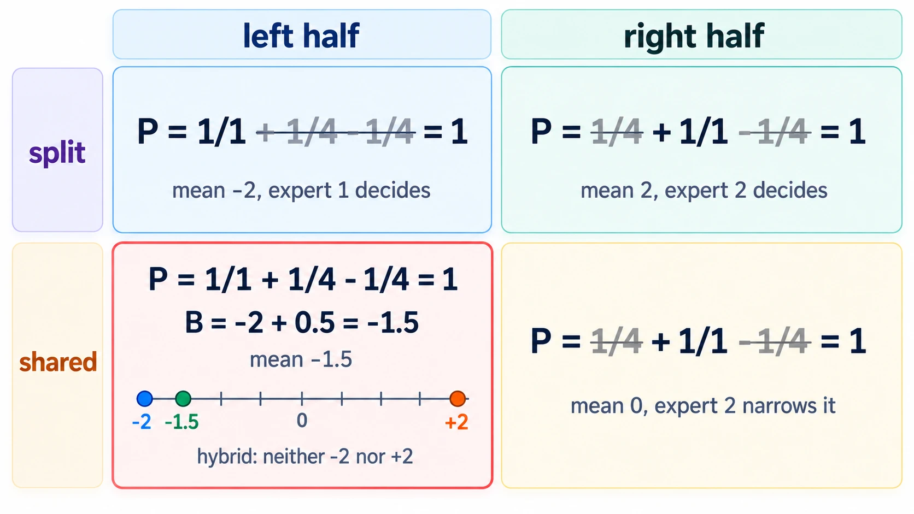

*The mechanism, the wall cancelling in each half an expert does not touch, and the two pulls meeting in shared's left half.*

*🖼️ Diagram wanted: the deep-dive sheet composing the form, the mechanism and the picture. Prompt 6 in the same file.*

### Other ways to compose

- **The plain product $p_1 p_2$**, the product of experts with no background. It counts the wall once per extra expert, so its centres sit nearer the middle, as the purple crosses show.
- **The Bayes composition**, $\nabla \log p_1 + \nabla \log p_2 - \nabla \log p_{\text{uncond}}$, two conditional scores minus the unconditional one. It is Definition 5.1 with the unconditional distribution as the background, and the paper's equation (1) is an instance of it. *Cited:* the walk's read-ahead, `read-ahead/03-prior-definitions.md`, on chunks 13 and 42.
- **Sampling-side corrections**, such as the samplers of Du et al. (arXiv 2302.11552), which fix how the sum is sampled and leave the target density unchanged. *Stated:* not read in this walk yet.

Choosing the unconditional model as the background, the Bayes composition, is where the rule most often goes wrong. The paper shows it on images and on exact-score toys.

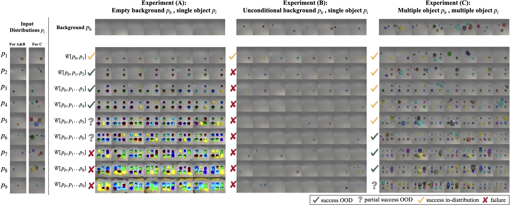

> **Figure 3.** **Attempted compositional length-generalization up to 9 objects.** We attempt to compose via linear score combination the distributions $p_1$ through $p_9$ shown on the far left, where each $p_i$ is conditioned on a specific object location as described below. Settings (A) and (C) approximately satisfy the conditions of our theory of projective composition, and thus are expected to length-generalize at least somewhat, while setting (B) does not even approximately satisfy our conditions and indeed fails to length-generalize. **Experiment (A):** In this experiment, the distributions $p_i$ each contain a single object at a fixed location, and the background $p_b$ is empty. In this case any successful composition of more than one object represents length-generalization. We find that composition succeeds up to several objects, but then degrades as number of objects increases (see Section 5.3 for details). **Experiment (B):** Here the distributions $p_i$ are identical to (A), but the background $p_b$ is chosen as the unconditional distribution (i.e. a single object at a random location)— this the "Bayes composition" (Section 3). This composition entirely fails— remarkably, trying to compose many objects often produces no objects! **Experiment (C):** Here each distribution $p_i$ contains an object at a fixed location $i$, and 0-4 other objects (sampled uniformly) in random locations. The background distribution $p_b$ is a distribution of 1-5 objects (sampled uniformly) in random locations. In this case length-generalization means composition of more than 5 objects. This composition can length-generalize, but artifacts appear for large numbers of objects. See Section 5.3 for further discussion, and Table 1 for a quantitative analysis. In Section L we explore another configuration that improves length-generalization quality.
>
> *Bradley et al., Mechanisms of Projective Composition of Diffusion Models, ICML 2025, [arXiv 2502.04549](https://arxiv.org/abs/2502.04549), Figure 3. arXiv non-exclusive distribution licence; copied for study with citation.*

Column (A) is the toy's split with the empty wall as background, and it holds up to four objects before the scenes turn to coloured blobs. Column (B) keeps the same experts and swaps the wall for the unconditional model, which holds one object at a random place. Each expert's scene is empty away from its own object and this background is not, so the experts no longer differ from the background only on their own patch, and from two experts on the scenes come out with fewer objects than asked for, often none. *Cited:* the walk's read-ahead, `read-ahead/03-prior-definitions.md`, chunks 28 to 33.

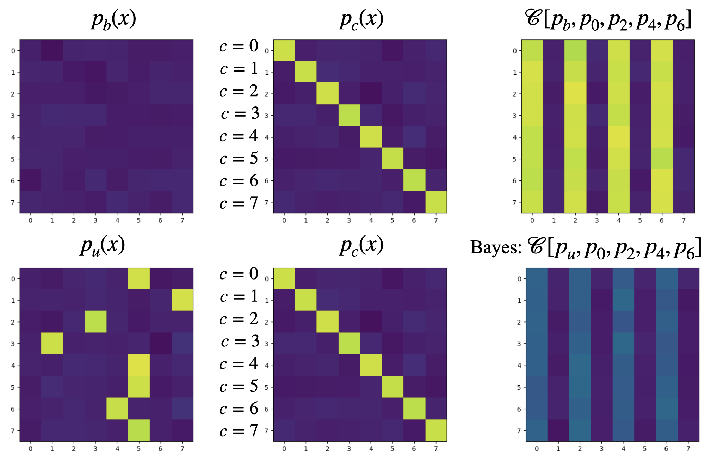 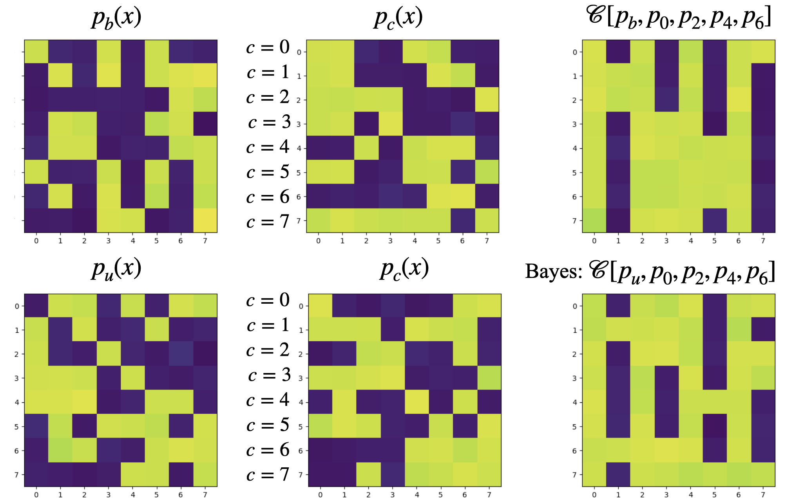

> **Figure 12.** Bayes composition vs. projective composition. All experiments use exact scores, which is possible since the diffusion-noised distributions are Gaussian mixtures. (Left) Distributions follow (17): each conditional $p_i$ activates index $i$ only, unconditional $p_u$ averages over the $p_i$, and background $p_b$ is all-zeros. We attempt to compose the conditions $p_0, p_2, p_4, p_6$ and hope to obtain the result $[1, 0, 1, 0, 1, 0]$. This requires length-generalization, since each of the conditionals $p_i$ contains only a single 1. The composition using the empty background $p_b$ (top) achieves this goal, while the Bayes composition using the unconditional $p_u$ (bottom) does not. Note that $[p_b, p_1, p_2, \ldots]$ satisfy Definition 5.2 while $[p_u, p_1, p_2, \ldots]$ does not. (Right) Distributions follow (18), where each conditional $p_i$ activates index $i$ on an independently 'cluttered' background. In this case the unconditional is similar to the cluttered background. Again we attempt to compose $p_0, p_2, p_4, p_6$, and in this case we find that the composition using $p_u$ works similarly well to $p_b$.
>
> *Bradley et al., Mechanisms of Projective Composition of Diffusion Models, ICML 2025, [arXiv 2502.04549](https://arxiv.org/abs/2502.04549), Figure 12, left and right panels. arXiv non-exclusive distribution licence; copied for study with citation.*

Figure 3's (A) against (B), with no trained model in the way. In each heatmap the columns are the eight coordinates; in the right-hand panels each row is one sample. On the left, the empty background lights columns 0, 2, 4 and 6 brightly in every row, and the Bayes composition lights them at about half strength. On the right, with a cluttered background, both light the same columns. The caption's target lists six entries where the panels have eight columns. *Shown:* read by eye from the panels.

### Why composition matters

The rule produces co-occurrence exactly when each expert differs from the background only on its own pixels. When two experts compete for the same pixels, it produces a hybrid, and no sampler can fix that, because the hybrid is the target density itself. This is the reading the learner's PhD proposal tests against the paper.

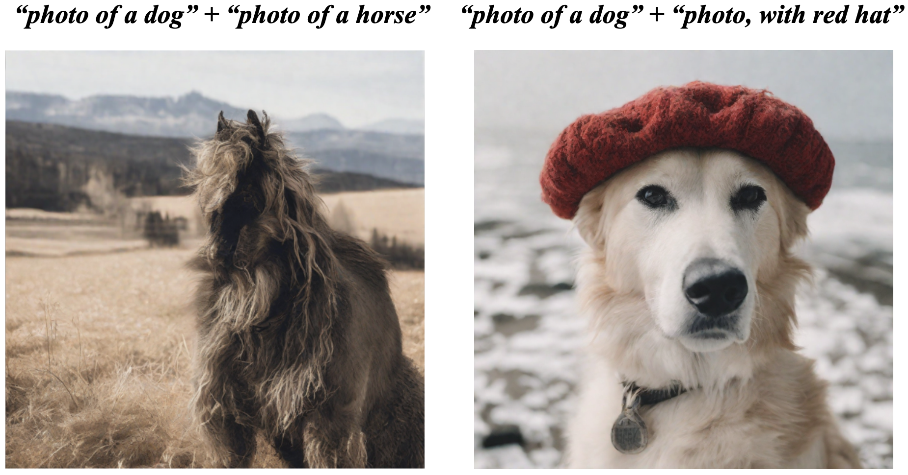

> **Figure 7.** **Composing Entangled Concepts.** The left image composes the text-conditions "photo of a dog" with "photo of a horse", which both control the subject of the image, and produces unexpected results. In contrast, the right image composes "photo of a dog" with "photo, with red hat," which intuitively correspond to disentangled features. Both samples from SDXL using score-composition with an unconditional background; details in Appendix C.
>
> *Bradley et al., Mechanisms of Projective Composition of Diffusion Models, ICML 2025, [arXiv 2502.04549](https://arxiv.org/abs/2502.04549), Figure 7. arXiv non-exclusive distribution licence; copied for study with citation.*

The left image is the toy's shared case at full scale. Both prompts want the subject, the way both experts want $x_0$, and the result is one animal with a horse's body and stance under a dog's shaggy coat and head: a hybrid, like the toy's $-1.5$. The right image is split. The hat owns the top of the head, the dog owns the rest, and both appear. *Shown:* the animal's description is read by eye from the picture.

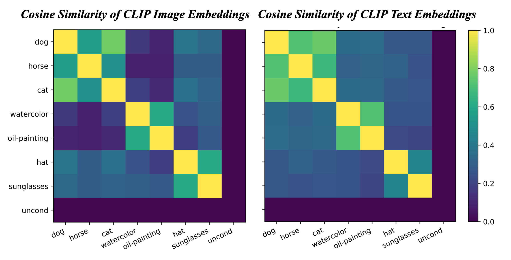

> **Figure 8.** Cosine similarity ($\frac{u^tv}{\|u\|\|v\|}$) between mean difference vectors $\mu_i - \mu_b$ and $\mu_j - \mu_b$, for each pair of concepts $i,j$, with $\mu_i$ estimated as either the average CLIP image embedding over several images representative of concept $i$ (left) or the CLIP text embedding for a single text description of concept $i$ (right). Details in Section D. Note that the groups of concepts {"dog", "horse", "cat"}, {"watercolor", "oil-painting"}, {"hat", "sunglasses"} have high intra- and low inter-group similarity. This suggests that concepts from different groups may successfully compose (such as "dog"+"hat" or "dog"+"oil-painting"), while concepts from the same group may not (such as "dog"+"horse"), consistent with the examples in Figures 1 and 7.
>
> *Bradley et al., Mechanisms of Projective Composition of Diffusion Models, ICML 2025, [arXiv 2502.04549](https://arxiv.org/abs/2502.04549), Figure 8. arXiv non-exclusive distribution licence; copied for study with citation.*

A way to tell shared from split before sampling. Each concept's direction away from the background, $\mu_i - \mu_b$, plays the part of the toy's "which half does this expert move". Split experts move different halves, so their directions are perpendicular and the cosine is 0. Read off the colour bar by eye, dog against horse is about 0.55 on image embeddings and 0.7 on text, while dog against hat is about 0.4 and 0.25, and Figures 7 and 1 came out as those numbers predict. The toy's split directions are $(-2, 0)$ and $(0, 2)$, with cosine exactly 0. Shared's are $(-2, 0)$ and $(2, 0)$, with cosine $-1$. *Derived* from the toy's means and the background mean $(0, 0)$.

The learner's [Gaussian Bowl Sketchpad](https://claude.ai/artifact/2TarMifiFoFyoB23eQFR64) shows one Gaussian's density as a surface. A page for this composition, with the wall, the two experts and the composed cloud, is being built in the journey's `artifacts/scenes/mechanisms-of-projective-composition/` and is not published yet.

### Composition taught in, applied in

**Taught in:**

- the `drip-read` walk of [the Mechanisms of Projective Composition paper note](../../deep-learning/01-poe-derivation-foundations/papers/mechanisms-of-projective-composition/), step 3a: the overlap prediction, the learner's question about the role of the background and the difference between shared and split, the re-teach with two-pixel images, and the per-coordinate derivation traced on paper
- the PoE derivation foundations journey's plan 13, `plans/13-poe-on-two-gaussians.md`, lines 173 to 182, which composes the same pair with the unconditional $\mathcal{N}(0, \operatorname{diag}(4, 4))$ as the background

**Applied in:** nothing yet.

> [!note]- How this was checked
> Every output above was run by the writer in an empty folder, `~/playground/sandbox/gaussian-clouds`, on the PC: Ubuntu under WSL2, through the prepared environment `~/.vault-sandbox/bin/python` (Python 3.11.13, NumPy 2.4.6, Matplotlib 3.11.2), on 2026-10-04. The folder was removed afterwards and the clean-up check returned 2.
>
> `toy.py` is the learner's own file from the walk's playground. `noised.py` is the learner's file with its print line rewritten to show the closed form beside each level, which the walk asked for. Its measured values matched the walk's answer key, `checks/noised.out`, to the digits shown. The four $\alpha$ values and $\bar\alpha = 0.4788$ in step 5 are plan 09's, line 143.
>
> The terminal picture was rendered from the captured text by a script in DejaVu Sans Mono, never drawn. The composition picture is `picture.py`'s own saved figure, checked by eye: the green dots sit at $(-2, 2)$ and $(-1.5, 0)$ and the purple crosses at $(-1.6, 1.6)$ and $(-1.2, 0)$.
>
> The paper's Figures 1, 2, 3, 4, 5, 7, 8 and 12 are the authors' own image files, copied byte for byte from the arXiv source package (`paper/source/figures/` in the journey's staged sources) into `references/`, and each was opened before filing. Each caption is the LaTeX caption from `src/intro.tex` (Figures 1, 2, 3), `src/projective_comp.tex` (4, 5), `src/practical.tex` (7, 8) and `src/appendix_notes.tex` (12), with LaTeX markup removed and every cross-reference written as the PDF prints it. The figure numbers are the ones printed in `2502.04549.pdf`, version 3. The paper is under arXiv's non-exclusive distribution licence, which does not grant a reuse licence; the copies are here for study, with citation on every embed. The lines under each caption tying a figure to the toy are the writer's, and each is marked shown, derived or cited.
>
> The re-teach in the walk described expert 2 in shared as an object in the left half only. It also narrows the right half, from variance 4 to 1, and the table and derivation here carry that.
>
> References, each answering 200 on 2026-10-04: [Ho et al. on arXiv](https://arxiv.org/abs/2006.11239), [Bradley et al. on arXiv](https://arxiv.org/abs/2502.04549), [Product of experts](https://en.wikipedia.org/wiki/Product_of_experts) on Wikipedia, CC BY-SA 4.0. Definition 5.1 and Definition 5.2 were read in the walk's read-ahead, `read-ahead/05-simple-construction.md`, which quotes the paper's source `src/composition.tex` lines 33 to 46. The sketchpad link is the learner's own private artifact and was not fetched. No tldr-pages entry covers this.
