# Multivariate Normal Distribution

Mathematics, Statistics, Distributions. Needs: the one-dimensional normal density, which the learner's [Gaussian Bowl Sketchpad](https://claude.ai/artifact/2TarMifiFoFyoB23eQFR64) lets you drag by its mean and variance.

> [!question] Test yourself
> [The diagonal Gaussian quiz](https://claude.ai/artifact/Vmd1FBg7oWwZq1onu9Jofa) covers [[#Diagonal covariance]], [[#Sampling a diagonal Gaussian]] and [[#Products and quotients of diagonal Gaussians]], including the paper's Figure 12, in 28 questions. Your attempts are saved on the page.

> [!warning] Unfinished
> - Three pictures for [[#Diagonal covariance]] are being redrawn: the form labelled a drawn length as a variance, the mechanism changed the mean without saying so, and the deep-dive sheet called the squared distance a distance. The current pictures stay until the new ones land. Their prompts are in the vault's `.prompts/Multivariate Normal Distribution.md`.
> - Six pictures are still to be drawn: the form, the mechanism and the deep-dive sheet for [[#Sampling a diagonal Gaussian]] and for [[#Products and quotients of diagonal Gaussians]]. Their prompts are in the same file.
> - The quiz page covers [[#Diagonal covariance]] only. The two newer sections are owed to it.
> - Only the diagonal case has a section yet. A full covariance, with the coordinates correlated, waits for a walk that uses one.
>
> Stated, not checked: 2 claims, each marked where it sits.

**A multivariate normal is a bell over many coordinates at once, set by a mean vector $\mu$ and a covariance matrix $\Sigma$.** In $d$ dimensions its density at a point $x$ is

$$
\mathcal{N}(x; \mu, \Sigma) = \frac{1}{(2\pi)^{d/2} \det(\Sigma)^{1/2}} \exp\!\left( -\tfrac{1}{2} (x - \mu)^\top \Sigma^{-1} (x - \mu) \right).
$$

The second argument is always a variance, so in one dimension this is $\mathcal{N}(\mu, \sigma^2)$. *Cited:* the Wikipedia page in the sources.

**Where you work.**

- Any terminal with Python 3 and `uv`. On the PC, that is Ubuntu under WSL.
- A new empty folder. Nothing here touches a real project.

**Prepare the sandbox.**

```bash
mkdir -p ~/playground/sandbox/numpy-arrays && cd ~/playground/sandbox/numpy-arrays
uv run --no-project --with numpy python -c "import numpy; print(numpy.__version__)"
```

You should see a version number; this run printed `2.4.6`.

## Table of contents

- [[#Diagonal covariance]]
- [[#Sampling a diagonal Gaussian]]
- [[#Products and quotients of diagonal Gaussians]]

## Diagonal covariance

Navigation: 📋 [[#Table of contents|TOC]] | [[#Sampling a diagonal Gaussian]] ➡️

**When $\Sigma$ is diagonal, the Gaussian is one independent bell per coordinate, so it is stored as two short arrays: the mean, and one variance per coordinate.** In two dimensions that is a pair of arrays of shape `(2,)`, and the covariance matrix never has to be written out.

### Diagonal Gaussian

**A diagonal Gaussian is a multivariate normal whose covariance is $\operatorname{diag}(\sigma_1^2, \dots, \sigma_d^2)$.** Its contours are ellipses lined up with the axes, never tilted. It is fully given by $(\mu, \sigma^2)$, two vectors of length $d$: in code, `(mu, var)`.

The learner's [Gaussian Bowl Sketchpad](https://claude.ai/artifact/2TarMifiFoFyoB23eQFR64), piece 1a-4 "the equation you can grab", shows this density as rings from above, and its slices through the surface as the one-dimensional bells scaled. The numbers it prints are the ones checked in [[#Try it yourself]] below.

### When to reach for it

When each coordinate spreads on its own and no two move together. Toy models of composition use it because the product of two diagonal Gaussians is again diagonal, and every step is one-dimensional arithmetic per coordinate. Writing a full $\Sigma$ for such a model hides that and costs a matrix inverse where a division would do.

### The form

$$
x \sim \mathcal{N}\!\left( \mu, \operatorname{diag}(\sigma_1^2, \sigma_2^2) \right)
\quad\Longleftrightarrow\quad
\texttt{mu} = (\mu^{(1)}, \mu^{(2)}), \;\; \texttt{var} = (\sigma_1^2, \sigma_2^2)
$$

```text
mu  = np.array([<mean of coordinate 1>, <mean of coordinate 2>])          shape (2,)
var = np.array([<variance of coordinate 1>, <variance of coordinate 2>])  shape (2,), every entry above 0
np.diag(var)                                                              the full 2 x 2 covariance, when a formula needs it
```

The arrays must be NumPy arrays, never lists, for the arithmetic below to work: see [[NumPy#Arrays versus Python lists]].

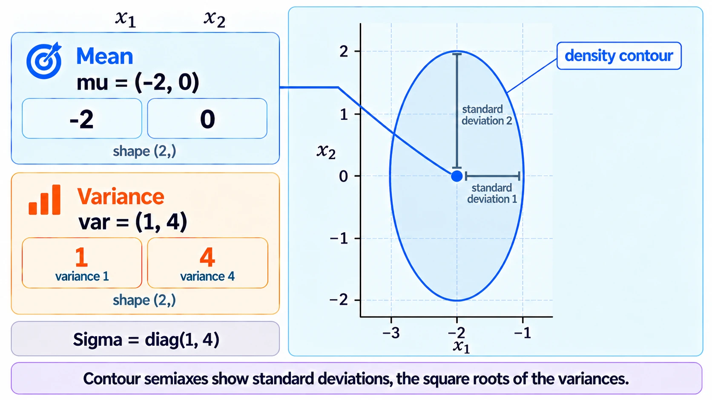

*The form, an axis-aligned ellipse with its mean dot and the two variances read off its two axes.*
### Try it yourself

**1. Make something to act on.** In the sandbox folder, save this as `gauss.py`. It evaluates the density of $\mathcal{N}(0, \operatorname{diag}(1, 4))$ at $x = (1, 2)$ two ways: with the full matrix, and as a product of one bell per coordinate.

```python
import numpy as np

mu, var = np.array([0.0, 0.0]), np.array([1.0, 4.0])
x = np.array([1.0, 2.0])

Sigma = np.diag(var)
u = x - mu
quad = u @ np.linalg.inv(Sigma) @ u
full = np.exp(-quad / 2) / np.sqrt((2 * np.pi) ** 2 * np.linalg.det(Sigma))
print("Sigma:", Sigma.tolist())
print("quad, full matrix:", quad)
print("quad, per coordinate:", np.sum(u**2 / var))
print("density, full matrix:", round(float(full), 6))

bells = np.exp(-u**2 / (2 * var)) / np.sqrt(2 * np.pi * var)
print("1D bells:", bells.round(6))
print("density, product of bells:", round(float(np.prod(bells)), 6))
print("bell height at c2 = 0, var 4:", round(1 / np.sqrt(2 * np.pi * 4.0), 4))
```

**2. The failure without the diagonal form.** Hand the variance array to a formula that wants the full matrix:

```bash
uv run --no-project --with numpy python -c "import numpy as np; np.linalg.inv(np.array([1.0, 4.0]))"
```

You should see the last line of an error:

```text
numpy.linalg.LinAlgError: 1-dimensional array given. Array must be at least two-dimensional
```

`var` is not $\Sigma$. Either rebuild the matrix with `np.diag(var)`, or skip the matrix and divide per coordinate.

**3. The technique.**

```bash
uv run --no-project --with numpy python gauss.py
```

You should see:

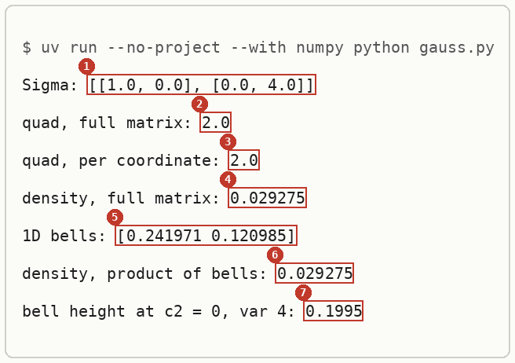

The full-matrix route and the per-coordinate route agree on every line. These are the sketchpad's numbers: $u^\top \Sigma^{-1} u = 2.0$ at $x = (1, 2)$, density $0.0293$, and the wall bell's peak $0.1995$ for $\sigma_2^2 = 4$.

**4. Another way to get the same answer.** SciPy reads a one-dimensional `cov` as the diagonal of $\Sigma$:

```bash
uv run --no-project --with numpy --with scipy python -c "from scipy.stats import multivariate_normal as mvn; print(round(float(mvn(mean=[0, 0], cov=[1, 4]).pdf([1, 2])), 6))"
```

```text
0.029275
```

**5. More worked examples: three clouds on a plane.** Plan 13 of the PoE derivation foundations journey, and the `drip-read` walk of the Mechanisms of Projective Composition paper, use four diagonal Gaussians, each stored as `(mu, var)`:

| Name | `mu` | `var` | What it looks like |
|---|---|---|---|
| background $p_b$ | `(0, 0)` | `(4, 4)` | a wide round cloud at the origin |
| expert 1 | `(-2, 0)` | `(1, 4)` | to the left, narrow left to right and tall |
| expert 2, "shared" | `(2, 0)` | `(4, 1)` | to the right, wide and flat |
| expert 2, "split" | `(0, 2)` | `(4, 1)` | the same shape, moved up instead of right |

Read the means against the background's `(0, 0)`. In "shared", expert 1 and expert 2 both move coordinate 1. In "split", expert 1 moves coordinate 1 and expert 2 moves coordinate 2, so each owns its own coordinate. The diagonal store makes that visible from the arrays alone: compare which entries of `mu` differ from the background's. The full code, and the composed means it gives, are in [[NumPy#Try it yourself]].

The peak of each cloud's density sits at its mean, where the exponent is 0, so its height is $1/(2\pi\sqrt{\sigma_1^2 \sigma_2^2})$: $1/(2\pi \cdot 4) = 0.0398$ for the background and $1/(2\pi \cdot 2) = 0.0796$ for each expert. These are the heights of the walk's 3D density surfaces. *Derived:* the density formula in [[#How it works]] at $u = 0$.

**6. Clean up, and prove it.**

```bash
cd ~ && rm -r ~/playground/sandbox/numpy-arrays
ls ~/playground/sandbox/numpy-arrays; echo $?
```

You should see `No such file or directory`, then `2`.

### Reading the output

| # | Field | This run | How to read it | Backing |
|---|---|---|---|---|
| 1 | Sigma | `[[1.0, 0.0], [0.0, 4.0]]` | `np.diag(var)`: the variances on the diagonal, zeros everywhere else | shown |
| 2 | quad, full matrix | `2.0` | $u^\top \Sigma^{-1} u$, the squared distance from the mean measured in standard deviations | shown |
| 3 | quad, per coordinate | `2.0` | the same sum as $1^2/1 + 2^2/4$, no matrix needed | derived below |
| 4 | density, full matrix | `0.029275` | the height of the 2D surface at $x = (1, 2)$ | shown |
| 5 | 1D bells | `[0.241971 0.120985]` | $\mathcal{N}(1; 0, 1)$ and $\mathcal{N}(2; 0, 4)$, one bell per coordinate | shown |
| 6 | density, product of bells | `0.029275` | the two bells multiplied: equal to field 4 | derived below |
| 7 | bell height at c2 = 0, var 4 | `0.1995` | $1/\sqrt{2\pi \cdot 4}$, the factor the sketchpad's slices are scaled by | derived below |

### How it works

With $\Sigma = \operatorname{diag}(\sigma_1^2, \sigma_2^2)$ and $u = x - \mu$:

$$
\begin{aligned}
\Sigma^{-1} &= \operatorname{diag}\!\left( \tfrac{1}{\sigma_1^2}, \tfrac{1}{\sigma_2^2} \right), \qquad \det \Sigma = \sigma_1^2 \sigma_2^2 \\
u^\top \Sigma^{-1} u &= \frac{(u^{(1)})^2}{\sigma_1^2} + \frac{(u^{(2)})^2}{\sigma_2^2} \\
\mathcal{N}(x; \mu, \Sigma) &= \frac{1}{2\pi \sqrt{\sigma_1^2 \sigma_2^2}} \exp\!\left( -\frac{(u^{(1)})^2}{2\sigma_1^2} - \frac{(u^{(2)})^2}{2\sigma_2^2} \right) \\
&= \frac{1}{\sqrt{2\pi\sigma_1^2}} e^{-(u^{(1)})^2 / 2\sigma_1^2} \cdot \frac{1}{\sqrt{2\pi\sigma_2^2}} e^{-(u^{(2)})^2 / 2\sigma_2^2} \\
&= \mathcal{N}(x^{(1)}; \mu^{(1)}, \sigma_1^2) \cdot \mathcal{N}(x^{(2)}; \mu^{(2)}, \sigma_2^2)
\end{aligned}
$$

So a diagonal Gaussian is exactly a product of independent one-dimensional bells, and the pair `(mu, var)` loses nothing.

The worked numbers, for $\mu = (0, 0)$, $\sigma^2 = (1, 4)$, $x = (1, 2)$:

$$
\begin{aligned}
u^\top \Sigma^{-1} u &= \tfrac{1^2}{1} + \tfrac{2^2}{4} = 1 + 1 = 2 \\
\mathcal{N}(x; \mu, \Sigma) &= \frac{e^{-1}}{2\pi \cdot 2} = \frac{0.367879}{12.566371} = 0.029275 \\
\frac{1}{\sqrt{2\pi \cdot 4}} &= \frac{1}{5.013257} = 0.1995
\end{aligned}
$$

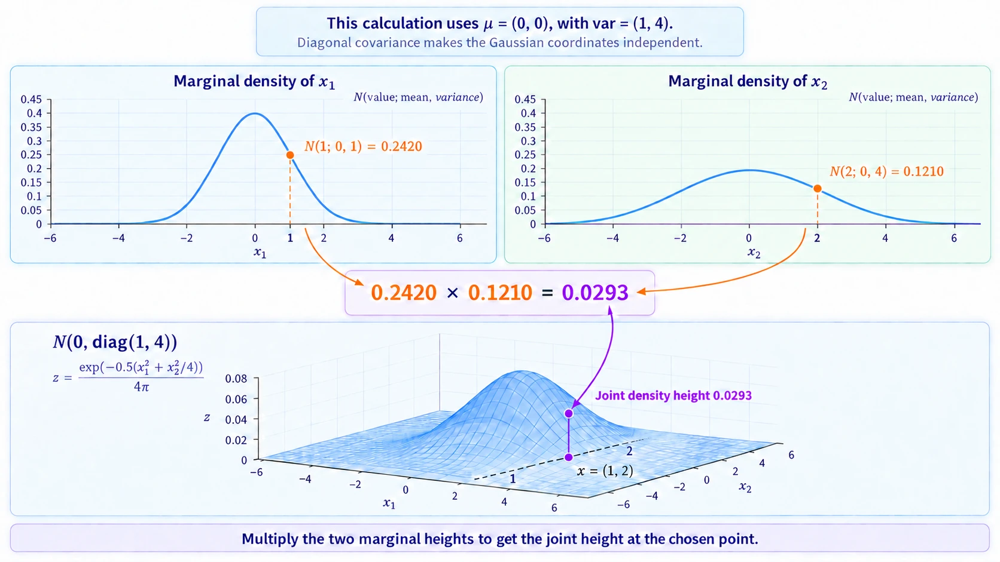

*The mechanism, the 2D bell cut along each axis into its two 1D bells, whose heights multiply to the surface's height.*
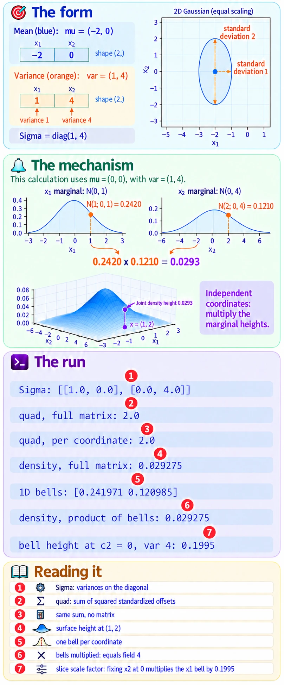

*The deep-dive sheet composing the form, the mechanism and the run.*
### Other ways

- **A full covariance**, when coordinates move together. The contours tilt, and nothing factorises per coordinate.
- **An isotropic Gaussian**, $\sigma^2 I$, when every coordinate has the same variance: one number instead of an array. The background $p_b$ above is one, with $\sigma^2 = 4$.
- **A Cholesky factor**, when sampling from a full covariance. The learner's LibreOffice note samples 50 points this way. *Stated:* not re-run here.

### Why this matters

Composition by product of experts multiplies densities. With diagonal Gaussians that product stays diagonal and is computed one coordinate at a time, which is why the toy models of composition use them: every composed mean and variance can be checked by hand, as plan 13 does.

### Taught in, applied in

**Taught in:**

- the `drip-read` walk of [the Mechanisms of Projective Composition paper note](../../../deep-learning/01-poe-derivation-foundations/papers/mechanisms-of-projective-composition/), step 1 of 3 up to the object, where the three clouds were written as `(mu, var)` pairs of shape `(2,)`
- the PoE derivation foundations journey's plan 13, `plans/13-poe-on-two-gaussians.md`, lines 69 to 70, 147 to 148, 173 to 174, 284 to 285 and 290 to 291
- the same journey's plan 08, `plans/08-score-of-a-gaussian.md`, line 192, with $\Sigma = \operatorname{diag}(1, 4)$
- the same journey's plan 14, `plans/14-kl-and-mutual-information.md`, line 171, with $\operatorname{diag}(1, 1)$ and $\operatorname{diag}(4, 1)$

**Applied in:** nothing yet.

**Before this note:** the learner's LibreOffice note `Mathematics/Statistics/Distributions/Multivariate Normal Distribution/Multivariate Normal Distribution.odt` defines the distribution by its mean and covariance matrix, and records that zero covariance means independent variables, with an example of $\mathcal{N}(0, I)$.

## Sampling a diagonal Gaussian

Navigation: ⬅️ [[#Diagonal covariance]] | 📋 [[#Table of contents|TOC]] | [[#Products and quotients of diagonal Gaussians]] ➡️

**To draw $n$ points from $\mathcal{N}(\mu, \operatorname{diag}(\sigma^2))$, draw $n$ standard-normal points and compute `mu + np.sqrt(var) * eps`: the mean moves every point, and the square root of each variance stretches its own axis.** One line does it for all $n$ points at once, because `mu` and `var` of shape `(2,)` are reused for every row of the `(n, 2)` matrix of draws. That reuse is [[NumPy#Broadcasting]].

### When to reach for sampling

When you want to see a distribution as a cloud of points, or check that the arrays you stored mean what you think: draw many points, measure their mean and variance, and compare them with the arrays. The check only works if it prints what it measured. Printing the arrays you passed in reports the input back to you, so a broken sampler looks perfect. Step 4 below shows one.

### The form of a sample

```text
rng = np.random.default_rng(<seed>)        one seeded generator, made once per file
eps = rng.standard_normal((<n>, <d>))      n points from N(0, I), shape (n, d)
x   = <mu> + np.sqrt(<var>) * eps          shape (n, d); mu and var, shape (d,), apply to every row
x.mean(0), x.var(0)                        the measured mean and variance of each coordinate, shape (d,)
```

`np.sqrt(var)` is the standard deviation. Multiplying by the variance itself is the usual slip, and step 6 shows what it does. Why the generator is made once and every draw comes from it is in [[NumPy#Random numbers from a seeded generator]].

*🖼️ Diagram wanted: the form, a cloud of standard-normal points moved by the mean and stretched per axis by the standard deviation. Prompt 3 in the vault's `.prompts/Multivariate Normal Distribution.md`.*

### Try sampling yourself

**1. What you need.** Python with NumPy, SciPy and Matplotlib. The commands below use the prepared environment `~/.vault-sandbox/bin/python`:

```bash
~/.vault-sandbox/bin/python -c "import numpy; print(numpy.__version__)"
```

You should see a version number. This run printed `2.4.6`.

**2. When it is missing.** Make it once, by hand: `uv venv ~/.vault-sandbox`, then `uv pip install --python ~/.vault-sandbox/bin/python pandas numpy scipy matplotlib statsmodels openpyxl`. Those two commands were not run here, since the environment already existed. Or write `uv run --no-project --with numpy python` wherever a command below says `~/.vault-sandbox/bin/python`: `samples.py` printed the same three lines that way.

**3. Make something to act on.** Make an empty folder and go into it:

```bash
mkdir -p ~/playground/sandbox/gaussian-clouds && cd ~/playground/sandbox/gaussian-clouds
```

Save the learner's `toy.py`, which stores the walk's four clouds as `(mean, variance)` pairs, the [[#Diagonal Gaussian]] form:

```python
import numpy as np

A = np.array
p_b = (A([0., 0.]), A([4., 4.]))       # background: wide and round
p_1 = (A([-2., 0.]), A([1., 4.]))      # expert 1: moves coordinate 0
p_2 = (A([2., 0.]), A([4., 1.]))       # expert 2, shared: moves coordinate 0 too
p_2s = (A([0., 2.]), p_2[1])           # expert 2, split: moves coordinate 1 instead

shared = [p_b, p_1, p_2]
split = [p_b, p_1, p_2s]

if __name__ == "__main__":
    for name, ps in [("shared", shared), ("split", split)]:
        print(name, [(m.tolist(), v.tolist()) for m, v in ps])
```

Look at it before sampling:

```bash
~/.vault-sandbox/bin/python toy.py
```

```text
shared [([0.0, 0.0], [4.0, 4.0]), ([-2.0, 0.0], [1.0, 4.0]), ([2.0, 0.0], [4.0, 1.0])]
split [([0.0, 0.0], [4.0, 4.0]), ([-2.0, 0.0], [1.0, 4.0]), ([0.0, 2.0], [4.0, 1.0])]
```

**4. The failure: printing what you passed in.** Save this as `echo_inputs.py`. Its sampler is broken on purpose: every point sits on the mean, with no spread at all. It prints each expert twice, once from the arrays it was given and once from the points it made:

```python
import numpy as np
from toy import shared

def sample(mu, var, n):
    return mu * np.ones((n, len(mu)))          # a broken sampler: no spread at all

for name, (mu, var) in zip(["p_b", "p_1", "p_2"], shared):
    x = sample(mu, var, 100_000)
    print(name, "printed inputs: mean", mu.tolist(), "var", var.tolist())
    print(name, "measured:       mean", x.mean(0).tolist(), "var", x.var(0).tolist())
```

```bash
~/.vault-sandbox/bin/python echo_inputs.py
```

You should see:

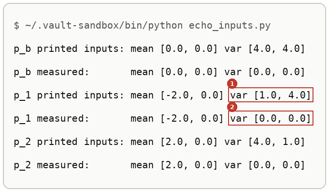

Marker 1 is what a print of the inputs shows: exactly the variances you asked for. Marker 2 is what the points actually have: none. A check that prints its inputs cannot fail, so it checks nothing.

**5. The technique.** Save this as `samples.py`. Every random number comes from the one seeded generator `rng`:

```python
import numpy as np
from toy import shared

rng = np.random.default_rng(0)
N = 100_000

def sample(mu, var, n):
    return mu + np.sqrt(var) * rng.standard_normal((n, len(mu)))

if __name__ == "__main__":
    for name, (mu, var) in zip(["p_b", "p_1", "p_2"], shared):
        x = sample(mu, var, N)
        print(name, x.shape, "mean", np.round(x.mean(0), 2).tolist(), "var", np.round(x.var(0), 2).tolist())
```

```bash
~/.vault-sandbox/bin/python samples.py
```

You should see:

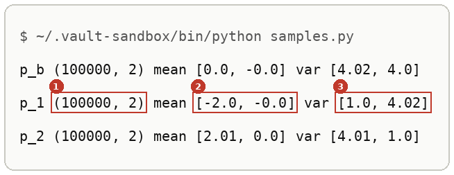

Run it again and the same three lines come back digit for digit, because the generator was seeded with 0. These are the walk's answer-key numbers at seed 0.

**6. Another way to get the same answer.** The generator's `normal` method takes the mean and the standard deviation and does the shift and stretch itself:

```bash
~/.vault-sandbox/bin/python -c "import numpy as np; rng = np.random.default_rng(0); x = rng.normal([-2.0, 0.0], np.sqrt([1.0, 4.0]), size=(100_000, 2)); print(x.shape, np.round(x.mean(0), 2).tolist(), np.round(x.var(0), 2).tolist())"
```

```text
(100000, 2) [-2.0, -0.0] [1.0, 4.0]
```

Its second argument, `scale`, is a standard deviation. Hand it the variance and the spread is squared:

```bash
~/.vault-sandbox/bin/python -c "import numpy as np; rng = np.random.default_rng(0); x = rng.normal([-2.0, 0.0], [1.0, 4.0], size=(100_000, 2)); print('scale given the variance:', np.round(x.var(0), 2).tolist())"
```

```text
scale given the variance: [1.0, 16.01]
```

The first coordinate hides the slip, since $\sqrt{1} = 1$. SciPy's `multivariate_normal` takes the variances directly, as a one-dimensional `cov`:

```bash
~/.vault-sandbox/bin/python -c "from scipy.stats import multivariate_normal as mvn; import numpy as np; x = mvn(mean=[-2, 0], cov=[1, 4]).rvs(size=100_000, random_state=0); print(x.shape, np.round(x.mean(0), 2).tolist(), np.round(x.var(0), 2).tolist())"
```

```text
(100000, 2) [-1.99, 0.0] [1.0, 3.99]
```

**7. More worked examples: the experts as clouds.** The walk's step 3a draws 2,000 points from each cloud and plots shared beside split. This is the walk's answer key, `checks/clouds.py`, run here unchanged. Save it as `clouds.py`:

```python
# Step 3a: the three experts as point clouds, shared beside split. Number: each cloud's spread (std) per axis.
import numpy as np, matplotlib; matplotlib.use("Agg"); import matplotlib.pyplot as plt
from toy import shared, split
rng = np.random.default_rng(0)
n = 2_000
names, colors = ["p_b background", "p_1 expert 1", "p_2 expert 2"], ["0.6", "tab:blue", "tab:orange"]
fig, axes = plt.subplots(1, 2, figsize=(10, 5), sharex=True, sharey=True)
for ax, (title, ps) in zip(axes, [("shared", shared), ("split", split)]):
    for (mu, var), name, c in zip(ps, names, colors):
        x = mu + np.sqrt(var) * rng.standard_normal((n, 2))
        ax.scatter(*x.T, s=2, alpha=0.4, c=c, label=name); ax.plot(*mu, "k+", ms=12)
        print(title, name, "std", np.round(x.std(0), 2).tolist())
    ax.set(title=title, xlim=(-7, 7), ylim=(-7, 7), aspect="equal", xlabel="coordinate 0"); ax.legend(loc="upper right", markerscale=5)
axes[0].set_ylabel("coordinate 1"); fig.savefig("clouds.png", dpi=110, bbox_inches="tight")
```

```bash
~/.vault-sandbox/bin/python clouds.py
```

```text
shared p_b background std [2.0, 1.99]
shared p_1 expert 1 std [1.02, 1.99]
shared p_2 expert 2 std [1.97, 1.0]
split p_b background std [1.98, 1.99]
split p_1 expert 1 std [0.98, 2.0]
split p_2 expert 2 std [2.0, 0.99]
```

and `clouds.png`:

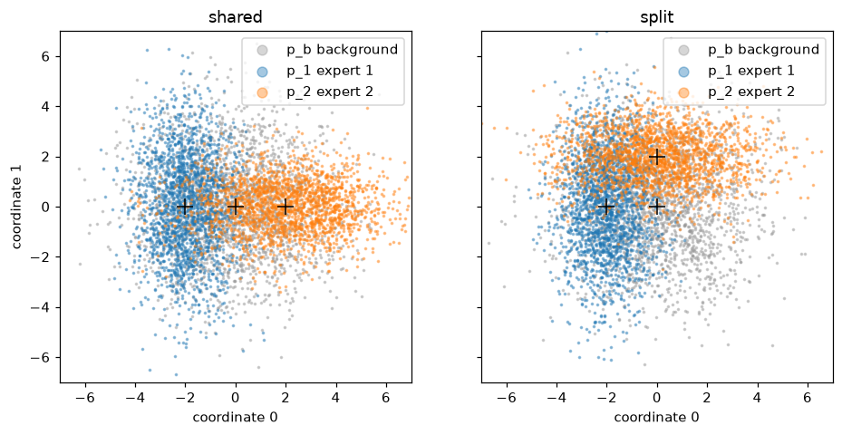

The printed numbers are standard deviations, the square roots of the variances: about 2 where the variance is 4 and about 1 where it is 1. In "shared" the orange cloud sits to the right of the origin, on the same axis as the blue one. In "split" it sits above the origin instead.

**8. Clean up, and prove it.** Keep the folder if you are going on to [[#Try composing yourself]], which uses `toy.py` again. Otherwise:

```bash
cd ~ && rm -r ~/playground/sandbox/gaussian-clouds
ls ~/playground/sandbox/gaussian-clouds; echo $?
```

You should see `No such file or directory`, then `2`.

### Reading the sampled output

From step 5, the `p_1` line:

| # | Field | This run | How to read it | Backing |
|---|---|---|---|---|
| 1 | shape | `(100000, 2)` | one row per point, one column per coordinate | shown |
| 2 | mean | `[-2.0, -0.0]` | the measured mean of each column, against the stored $(-2, 0)$; `-0.0` is a small negative number rounded to two places | shown |
| 3 | var | `[1.0, 4.02]` | the measured variance of each column, against the stored $(1, 4)$; 4.02 is about one standard error above 4 | derived below |

From step 4, the difference that matters:

| # | Field | This run | How to read it | Backing |
|---|---|---|---|---|
| 1 | printed inputs, var | `[1.0, 4.0]` | the array handed to the sampler, so it is right whatever the sampler does | shown |
| 2 | measured, var | `[0.0, 0.0]` | the spread of the points the sampler made: none, which exposes the bug | shown |

### How sampling works

One coordinate at a time. Take $\varepsilon \sim \mathcal{N}(0, 1)$ and set $x = m + s\,\varepsilon$:

$$
\begin{aligned}
\mathbb{E}[x] &= m + s\,\mathbb{E}[\varepsilon] = m + s \cdot 0 = m \\
\operatorname{Var}[x] &= s^2 \operatorname{Var}[\varepsilon] = s^2 \cdot 1 = s^2 \\
s = \sqrt{\sigma^2} \;&\Rightarrow\; \operatorname{Var}[x] = \sigma^2
\end{aligned}
$$

A shifted and scaled normal variable is again normal, so $x \sim \mathcal{N}(m, \sigma^2)$. *Cited:* the Normal distribution page in the sources. The columns of `eps` are independent, so the columns of `x` are too, and the cloud is the diagonal Gaussian $\mathcal{N}(\mu, \operatorname{diag}(\sigma^2))$.

The worked numbers for `p_1`, $\mu = (-2, 0)$ and $\sigma^2 = (1, 4)$:

$$
\begin{aligned}
\text{coordinate 1: } & x = -2 + \sqrt{1}\,\varepsilon \sim \mathcal{N}(-2, 1) \\
\text{coordinate 2: } & x = 0 + \sqrt{4}\,\varepsilon = 2\varepsilon \sim \mathcal{N}(0, 4)
\end{aligned}
$$

How far a measured value may sit from the truth: with $n$ points, the standard error of a measured mean is $\sqrt{\sigma^2/n}$, and of a measured variance $\sigma^2\sqrt{2/(n-1)}$ for normal data. *Cited:* the Variance page in the sources. For $\sigma^2 = 4$ and $n = 100{,}000$:

$$
\begin{aligned}
\sqrt{4 / 100000} &= 0.0063 \\
4\sqrt{2 / 99999} &= 0.0179
\end{aligned}
$$

So 4.02 sits about one standard error from 4, which is ordinary, and the walk's tolerance of 0.05 is close to three standard errors.

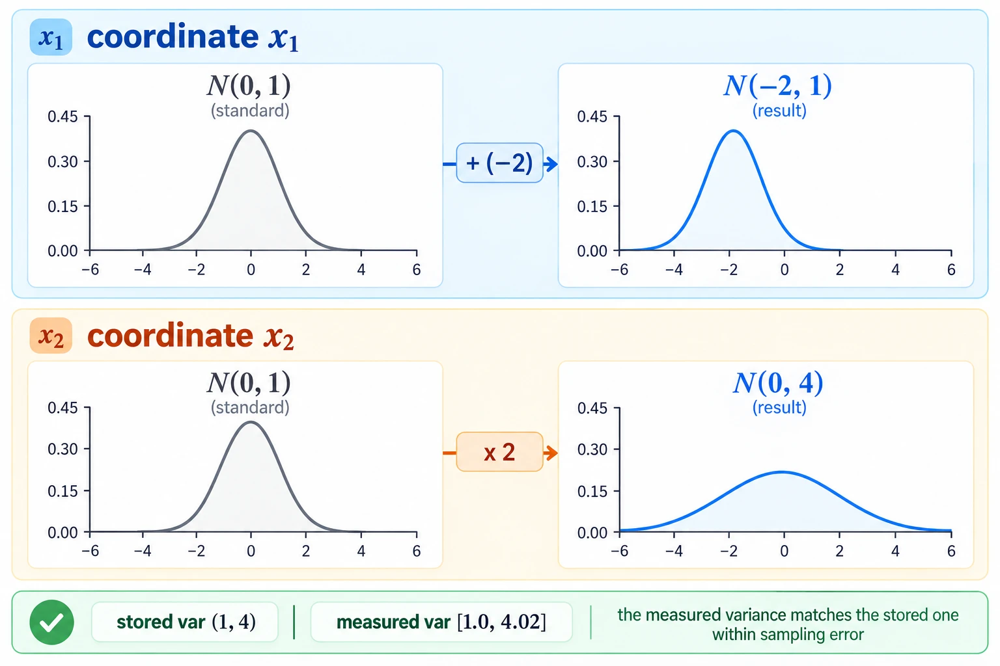

*The mechanism, one standard-normal bell moved by $m$ and widened by $s = \sqrt{\sigma^2}$, once per axis.*

*🖼️ Diagram wanted: the deep-dive sheet composing the form, the mechanism and the run. Prompt 5 in the same file.*

### Other ways to sample

- **`rng.normal(mu, np.sqrt(var), size=(n, d))`**, when you would rather not write the shift and stretch. Its `scale` is a standard deviation, as step 6 shows.
- **SciPy's `multivariate_normal(mean, cov).rvs(...)`**, when the same object should also give densities. A one-dimensional `cov` is read as the variances.
- **A Cholesky factor of a full covariance**, when the coordinates are correlated; see [[#Other ways]] under the diagonal case.

### Why sampling matters

Every later step of the walk starts from a cloud: noising it in [[Diffusion Models#The forward process in one jump]], and composing it with others in [[Diffusion Models#Composing models with a background]]. A sampler whose measured numbers you have checked is one you can trust when a later number looks wrong.

### Sampling taught in, applied in

**Taught in:**

- the `drip-read` walk of [the Mechanisms of Projective Composition paper note](../../../deep-learning/01-poe-derivation-foundations/papers/mechanisms-of-projective-composition/), step 2, where the learner's `sample(mu, var, n)` measured all three clouds within 0.05 of their arrays (`p_1 (100000, 2) mean [-2.0, -0.0] var [1.0, 4.02]`) once the walk had corrected two slips: printing the input arrays instead of the measured numbers, and drawing from `np.random` instead of the seeded `rng`; and step 3a, the experts as clouds
- the PoE derivation foundations journey's plan 09, `plans/09-the-forward-process.md`, line 148, which draws 200,000 samples from the closed form the same way

**Applied in:** nothing yet.

## Products and quotients of diagonal Gaussians

Navigation: ⬅️ [[#Sampling a diagonal Gaussian]] | 📋 [[#Table of contents|TOC]]

**Multiplying two Gaussian densities adds their precisions, one over each variance, and dividing by a third subtracts its precision, so $p_1 p_2 / p_b$ is again a Gaussian.** Per coordinate, its precision is $P = 1/v_1 + 1/v_2 - 1/v_b$, its variance is $1/P$, and its mean is $B/P$ with $B = m_1/v_1 + m_2/v_2 - m_b/v_b$. The result is a density only while $P > 0$.

### When to reach for precisions

When densities are multiplied: composing experts as a product, dividing out a shared background as in [[Diffusion Models#Composing models with a background]], or a prior times a likelihood. Without the formula you multiply the densities on a grid and search for the peak, which works in one or two dimensions and gives no rule to reason with. Step 6 below does it that way, as a check.

### The form of a composed Gaussian

```text
P    = 1/v1 + 1/v2 - 1/vb       the composed precision, per coordinate; must be above 0
B    = m1/v1 + m2/v2 - mb/vb    each mean weighted by its own precision, summed the same way
mean = B / P                    the composed mean
var  = 1 / P                    the composed variance
```

For a plain product $p_1 p_2$, drop the two terms with $b$ in them.

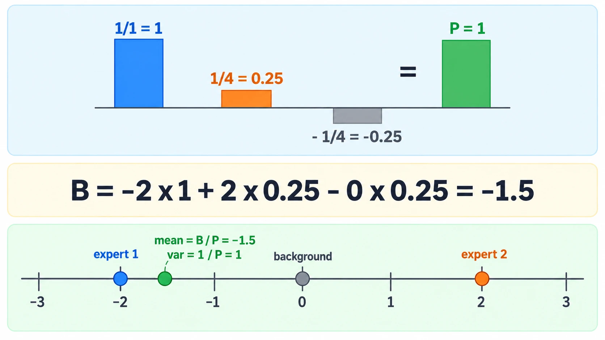

*The form, three precision bars adding and subtracting into one, with the means pulled by their weights.*

### Try composing yourself

**1. What you need, and when it is missing.** The same as steps 1 and 2 of [[#Try sampling yourself]].

**2. Make something to act on.** In `~/playground/sandbox/gaussian-clouds`, with the `toy.py` of [[#Try sampling yourself]] step 3 saved there.

**3. Look at it before: where do the two experts overlap?** Before plotting, the walk asked where expert 1 and expert 2 overlap. The walk's answer key, `checks/overlap.py`, multiplies the two experts with no background. Save it as `overlap.py`:

```python
# Step 3a's prediction: where blue and orange overlap (the peak of p_1 * p_2) and how much (the integral of p_1 * p_2).
import numpy as np
from toy import shared, split
for name, ps in [("shared", shared), ("split", split)]:
    (m1, v1), (m2, v2) = ps[1], ps[2]
    prec = 1 / v1 + 1 / v2                                   # precisions add when densities multiply
    centre = (m1 / v1 + m2 / v2) / prec                      # precision-weighted average of the two means
    amount = np.prod(np.exp(-0.5 * (m1 - m2)**2 / (v1 + v2)) / np.sqrt(2 * np.pi * (v1 + v2)))
    print(f"{name}: overlap centre {np.round(centre, 2).tolist()}, overlap amount {amount:.4f}")
```

```bash
~/.vault-sandbox/bin/python overlap.py
```

```text
shared: overlap centre [-1.2, 0.0], overlap amount 0.0064
split: overlap centre [-1.6, 1.6], overlap amount 0.0143
```

Neither overlap is centred on the origin, and the split pair overlaps more than twice as much as the shared pair. What these two points mean for composition, and why the background changes them, is in [[Diffusion Models#Composing models with a background]].

**4. The failure: a background narrower than the experts.** Save this as `narrow.py`. It composes one coordinate with a background of variance 0.5, narrower than both experts:

```python
import numpy as np

(mb, vb), (m1, v1), (m2, v2) = (0.0, 0.5), (-2.0, 1.0), (2.0, 4.0)
P = 1 / v1 + 1 / v2 - 1 / vb
B = m1 / v1 + m2 / v2 - mb / vb
print("P", P, "B", B)
for x in (0.0, 5.0, 10.0):
    print("x", x, "log C + const", round(-P / 2 * x**2 + B * x, 2))
```

```bash
~/.vault-sandbox/bin/python narrow.py
```

```text
P -0.75 B -1.5
x 0.0 log C + const 0.0
x 5.0 log C + const 1.88
x 10.0 log C + const 22.5
```

The precision is negative, so the log of the result grows without limit as $x$ moves away from 0. No constant can make it integrate to 1, and "divide by the background" has returned something that is not a probability density. This is plan 13's narrow-unconditional case.

**5. The technique.** Save this as `compose.py`. It composes both versions with and without the background, one coordinate per array entry:

```python
import numpy as np
from toy import shared, split

def compose(ps, divide_background=True):
    (mb, vb), (m1, v1), (m2, v2) = ps
    k = 1 if divide_background else 0
    P = 1 / v1 + 1 / v2 - k / vb
    B = m1 / v1 + m2 / v2 - k * mb / vb
    return P, B, B / P, 1 / P

for name, ps in [("split", split), ("shared", shared)]:
    for wall in (True, False):
        P, B, mean, var = compose(ps, wall)
        label = "p1 p2 / p_b" if wall else "p1 p2      "
        print(f"{name:6} {label}  P {P.tolist()}  B {B.tolist()}  mean {mean.tolist()}  var {var.tolist()}")
```

```bash
~/.vault-sandbox/bin/python compose.py
```

You should see:

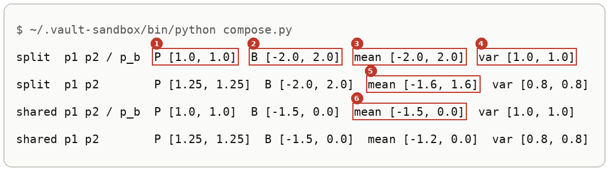

Lines 2 and 4 are the overlap centres of step 3. Dividing out the background moves split from $(-1.6, 1.6)$ to $(-2, 2)$ and shared from $(-1.2, 0)$ to $(-1.5, 0)$. These match the walk's answer key, `checks/compose.py`, and plan 13.

**6. Another way to get the same answer.** Save this as `grid_check.py`. It never uses the formula: it evaluates $\log p_1 + \log p_2 - \log p_b$ on 24,001 points per coordinate, turns it into weights, and measures the mean and variance of the weights:

```python
import numpy as np
from scipy.stats import norm
from toy import shared, split

g = np.linspace(-12, 12, 24_001)
for name, ps in [("split", split), ("shared", shared)]:
    (mb, vb), (m1, v1), (m2, v2) = ps
    out = []
    for c in (0, 1):
        logc = (norm.logpdf(g, m1[c], np.sqrt(v1[c])) + norm.logpdf(g, m2[c], np.sqrt(v2[c]))
                - norm.logpdf(g, mb[c], np.sqrt(vb[c])))
        w = np.exp(logc - logc.max())
        w /= w.sum()
        m = (w * g).sum()
        out.append((round(float(m), 4), round(float((w * (g - m) ** 2).sum()), 4)))
    print(name, "grid mean, var per coordinate:", out)
```

```bash
~/.vault-sandbox/bin/python grid_check.py
```

```text
split grid mean, var per coordinate: [(-2.0, 1.0), (2.0, 1.0)]
shared grid mean, var per coordinate: [(-1.5, 1.0), (-0.0, 1.0)]
```

The grid agrees with the formula on all eight numbers.

**7. Clean up, and prove it.**

```bash
cd ~ && rm -r ~/playground/sandbox/gaussian-clouds
ls ~/playground/sandbox/gaussian-clouds; echo $?
```

You should see `No such file or directory`, then `2`.

### Reading the composed output

From step 5, the first line (split, background divided out), then what differs on the others:

| # | Field | This run | How to read it | Backing |
|---|---|---|---|---|
| 1 | P | `[1.0, 1.0]` | the composed precision of each coordinate: how sharply the result is peaked | derived below |
| 2 | B | `[-2.0, 2.0]` | each mean times its own precision, summed with the background's taken away | derived below |
| 3 | mean | `[-2.0, 2.0]` | $B/P$: each coordinate lands where its own expert put it | derived below |
| 4 | var | `[1.0, 1.0]` | $1/P$: as narrow as the narrow expert on each coordinate | derived below |
| 5 | split, no background, mean | `[-1.6, 1.6]` | the same $B$ over a larger $P$ of 1.25, so both coordinates are pulled 20% toward 0 | derived below |
| 6 | shared, background divided out, mean | `[-1.5, 0.0]` | coordinate 1 lands between $-2$ and $+2$, at a value neither expert put there | derived below |

### How the product works

For one coordinate, write each density through its logarithm, which drops the constant in front:

$$
\log \mathcal{N}(x; m, v) = -\frac{(x - m)^2}{2v} + \text{const}
$$

Multiplying densities adds logs, and dividing subtracts:

$$
\begin{aligned}
\log C &= \log p_1 + \log p_2 - \log p_b + \text{const} \\
&= -\frac{(x - m_1)^2}{2 v_1} - \frac{(x - m_2)^2}{2 v_2} + \frac{(x - m_b)^2}{2 v_b} + \text{const}
\end{aligned}
$$

Expand each square, $(x - m)^2 = x^2 - 2mx + m^2$, and collect the powers of $x$. The $m^2$ terms join the constant.

$$
\begin{aligned}
x^2 \text{ coefficient: } & -\tfrac{1}{2}\left( \tfrac{1}{v_1} + \tfrac{1}{v_2} - \tfrac{1}{v_b} \right) = -\tfrac{1}{2} P \\
x \text{ coefficient: } & \tfrac{m_1}{v_1} + \tfrac{m_2}{v_2} - \tfrac{m_b}{v_b} = B \\
\log C &= -\tfrac{P}{2} x^2 + B x + \text{const}
\end{aligned}
$$

Complete the square:

$$
\begin{aligned}
-\tfrac{P}{2} x^2 + B x &= -\tfrac{P}{2}\left( x^2 - \tfrac{2B}{P} x \right) \\
&= -\tfrac{P}{2}\left( x - \tfrac{B}{P} \right)^2 + \tfrac{B^2}{2P}
\end{aligned}
$$

So $\log C = -\frac{(x - B/P)^2}{2 \cdot (1/P)} + \text{const}$, which is the log of a Gaussian with mean $B/P$ and variance $1/P$, provided $P > 0$. When $P < 0$ the square enters with a plus sign and step 4's growth follows.

The worked numbers, from the walk:

$$
\begin{aligned}
\text{split, right half: } P &= \tfrac{1}{4} + \tfrac{1}{1} - \tfrac{1}{4} = 1, & B &= \tfrac{0}{4} + \tfrac{2}{1} - \tfrac{0}{4} = 2, & \text{mean } 2,\ \text{var } 1 \\
\text{shared, left half: } P &= \tfrac{1}{1} + \tfrac{1}{4} - \tfrac{1}{4} = 1, & B &= \tfrac{-2}{1} + \tfrac{2}{4} - \tfrac{0}{4} = -1.5, & \text{mean } {-1.5},\ \text{var } 1 \\
\text{split, right half, no background: } P &= \tfrac{1}{4} + \tfrac{1}{1} = 1.25, & B &= 2, & \text{mean } 1.6,\ \text{var } 0.8 \\
\text{narrow background, step 4: } P &= \tfrac{1}{1} + \tfrac{1}{4} - \tfrac{1}{0.5} = -0.75 & &
\end{aligned}
$$

In the split right half, expert 1's $\frac{1}{4}$ cancels the background's $-\frac{1}{4}$: expert 1 says nothing there that the background did not already say, so dividing removes it and expert 2 decides alone.

The overlap amount of step 3 is the integral of the plain product, one coordinate at a time: $\int \mathcal{N}(x; m_1, v_1)\,\mathcal{N}(x; m_2, v_2)\,dx = \mathcal{N}(m_1; m_2, v_1 + v_2)$, the leftover constant of the completed square. *Stated:* this identity is not derived here; the textbook section §10.1 of the journey keeps the constant. For shared:

$$
\begin{aligned}
\mathcal{N}(-2; 2, 5) &= \frac{e^{-16/10}}{\sqrt{2\pi \cdot 5}} = \frac{0.2019}{5.6050} = 0.03602 \\
\mathcal{N}(0; 0, 5) &= \frac{1}{5.6050} = 0.17841 \\
0.03602 \times 0.17841 &= 0.0064
\end{aligned}
$$

and for split, $\mathcal{N}(-2; 0, 5)\,\mathcal{N}(0; 2, 5) = 0.11959^2 = 0.0143$. Both match step 3's run.

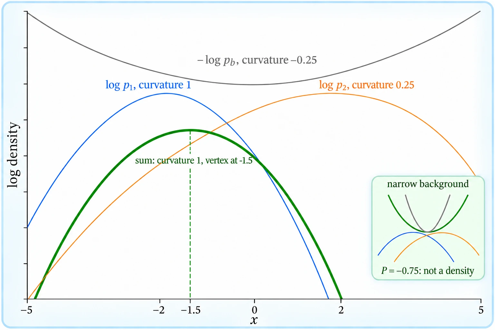

*The mechanism, the three log-parabolas adding into one whose vertex is the composed mean.*

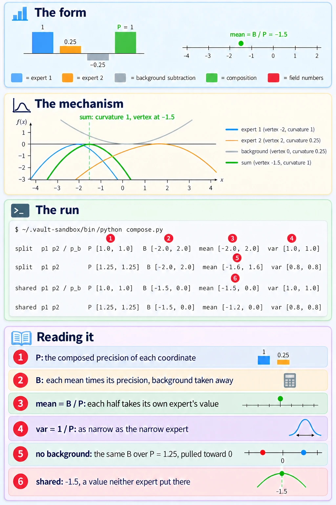

*The deep-dive sheet composing the form, the mechanism and the run.*

### Other ways to compose

- **On a grid**, as in step 6, when the densities are not Gaussian. It costs one evaluation per grid point per coordinate and gives numbers, not a formula.
- **With full covariances**, when coordinates are correlated: the precision matrices add and subtract the same way, $\Lambda = \Sigma_1^{-1} + \Sigma_2^{-1} - \Sigma_b^{-1}$, and the mean is $\Lambda^{-1}(\Sigma_1^{-1}\mu_1 + \Sigma_2^{-1}\mu_2 - \Sigma_b^{-1}\mu_b)$, valid while every eigenvalue of $\Lambda$ is above 0. *Cited:* plan 13, lines 67 to 69 and 173 to 182.
- **Through scores**, the gradients of the logs, which add and subtract with no normalising constant at all. This is how a diffusion model composes: see [[Diffusion Models#Composing models with a background]].

### Why precisions matter

Each density's pull on the composed mean is its precision. In the shared left half, expert 1 has precision 1 and expert 2 has precision $\frac{1}{4}$, so the composed mean $-1.5$ sits much nearer expert 1's $-2$ than expert 2's $+2$. The background's subtraction can also take the precision below 0, and step 4 shows that the result then stops being a distribution at all.

The same arithmetic composes four experts as readily as two. The paper's exact-score toy multiplies four Gaussians in 8 dimensions and divides out one background three times.


> **Figure 12.** Bayes composition vs. projective composition. All experiments use exact scores, which is possible since the diffusion-noised distributions are Gaussian mixtures. (Left) Distributions follow (17): each conditional $p_i$ activates index $i$ only, unconditional $p_u$ averages over the $p_i$, and background $p_b$ is all-zeros. We attempt to compose the conditions $p_0, p_2, p_4, p_6$ and hope to obtain the result $[1, 0, 1, 0, 1, 0]$. This requires length-generalization, since each of the conditionals $p_i$ contains only a single 1. The composition using the empty background $p_b$ (top) achieves this goal, while the Bayes composition using the unconditional $p_u$ (bottom) does not. Note that $[p_b, p_1, p_2, \ldots]$ satisfy Definition 5.2 while $[p_u, p_1, p_2, \ldots]$ does not.
>
> *Bradley et al., Mechanisms of Projective Composition of Diffusion Models, ICML 2025, [arXiv 2502.04549](https://arxiv.org/abs/2502.04549), Figure 12, left panel only; the caption's sentences on the right panel are left out with it. arXiv non-exclusive distribution licence; copied for study with citation.*

Equation (17) of the paper makes each expert an isotropic Gaussian, $p_i = \mathcal{N}(e_i, \sigma^2 I)$ with $e_i$ the vector holding a single 1 at index $i$, and the background $p_b = \mathcal{N}(0, \sigma^2 I)$. *Cited:* the paper, Appendix G, equation (17). Four experts over one background divide it out three times, so per coordinate $j$:

$$
\begin{aligned}
P &= \tfrac{4}{\sigma^2} - \tfrac{3}{\sigma^2} = \tfrac{1}{\sigma^2} \\
B_j &= \tfrac{1}{\sigma^2} \ \text{ for } j \in \{0, 2, 4, 6\}, \qquad B_j = 0 \ \text{ otherwise} \\
\text{mean}_j &= B_j / P = 1 \ \text{ for } j \in \{0, 2, 4, 6\}, \qquad 0 \ \text{ otherwise}, \qquad \text{var} = \sigma^2
\end{aligned}
$$

At coordinate 0 only $p_0$ has mean 1. The other three experts have mean 0 there, the background's mean, at the background's variance, so they cancel its three copies, the way expert 1 cancels the background in the toy's split right half. The composed mean is $(1, 0, 1, 0, 1, 0, 1, 0)$, and the top-right heatmap lights exactly columns 0, 2, 4 and 6 in every sampled row. *Derived* above, and *shown* in the figure. The Bayes composition below it divides by $p_u$, a mixture of eight Gaussians, which this precision rule does not cover.

### Precisions taught in, applied in

**Taught in:**

- the `drip-read` walk of [the Mechanisms of Projective Composition paper note](../../../deep-learning/01-poe-derivation-foundations/papers/mechanisms-of-projective-composition/), step 3a, the overlap prediction and the re-teach that followed it, where the learner traced the per-coordinate derivation above on paper
- the PoE derivation foundations journey's plan 13, `plans/13-poe-on-two-gaussians.md`, lines 150 to 152 (the precision-sum formula), 173 to 182 (the wide and the narrow background) and 277 to 294 (the product on paper), with its textbook chapter `textbook/10-completing-the-square.md`, sections 10.1 and 10.2

**Applied in:** nothing yet.

> [!note]- How this was checked
> Every output in [[#Diagonal covariance]] was run by the writer in an empty folder, `~/playground/sandbox/numpy-arrays`, on the PC: Ubuntu under WSL2, Python 3.12.3, NumPy 2.4.6 and SciPy through uv 0.8.13, on 2026-10-04. The folder was removed afterwards and the check in step 6 returned 2.
>
> Every output in [[#Sampling a diagonal Gaussian]] and [[#Products and quotients of diagonal Gaussians]] was run by the writer in an empty folder, `~/playground/sandbox/gaussian-clouds`, on the PC: Ubuntu under WSL2, through the prepared environment `~/.vault-sandbox/bin/python` (Python 3.11.13, NumPy 2.4.6, SciPy 1.17.1, Matplotlib 3.11.2), on 2026-10-04. `samples.py` was also run through `uv run --no-project --with numpy python` (uv 0.8.13) and printed the same three lines. The folder was removed afterwards and the clean-up check returned 2.
>
> `toy.py` is the learner's own file, copied byte for byte from the walk's playground. `clouds.py` and `overlap.py` are the walk's answer keys, copied unchanged from `checks/` in the journey's `sources/mechanisms-of-projective-composition/`; their outputs matched `checks/clouds.out` and `checks/overlap.out` exactly. `samples.py` matched `checks/samples.out` exactly, and `compose.py`, which prints more fields, agreed with every composed mean and variance in `checks/compose.out`. The learner's own `samples.py` in the playground still draws from `np.random`, so its printed numbers differ slightly from the seed-0 numbers here.
>
> The sketchpad values (2.0, 0.0293, 0.1995) come from the learner's screenshots of the Gaussian Bowl Sketchpad and match `gauss.py`'s output to the digits shown. The three clouds' values match plan 13 and the walk's answer key, `checks/toy.py` in the journey's `sources/mechanisms-of-projective-composition/`.
>
> The four terminal pictures were rendered from the captured text by a script in DejaVu Sans Mono, never drawn. The cloud picture is `clouds.py`'s own saved figure.
>
> The paper's Figure 12, left panel, is the authors' own image file `eg1.png`, copied byte for byte from the arXiv source package (`paper/source/figures/` in the journey's staged sources) into `references/`, and opened before filing. Its caption is the LaTeX caption in `src/appendix_notes.tex`, with markup removed and its cross-references written as the PDF prints them; the figure number is the one printed in `2502.04549.pdf`, version 3. Equation (17) was read in the same file, lines 105 to 111. The right panel was left out because its clean distributions flip each coordinate like a coin, equation (18), so once noised they are Gaussian mixtures rather than single Gaussians. The paper is under arXiv's non-exclusive distribution licence, which does not grant a reuse licence; the copy is here for study, with citation on the embed.
>
> References: [Multivariate normal distribution](https://en.wikipedia.org/wiki/Multivariate_normal_distribution), [Normal distribution](https://en.wikipedia.org/wiki/Normal_distribution) and [Variance](https://en.wikipedia.org/wiki/Variance) on Wikipedia, CC BY-SA 4.0; [Generator.normal](https://numpy.org/doc/stable/reference/random/generated/numpy.random.Generator.normal.html) and [scipy.stats.multivariate_normal](https://docs.scipy.org/doc/scipy/reference/generated/scipy.stats.multivariate_normal.html), BSD 3-Clause; and [the paper on arXiv](https://arxiv.org/abs/2502.04549). Each answered 200 on 2026-10-04. No tldr-pages entry covers this. The sketchpad link is the learner's own private artifact and was not fetched.
