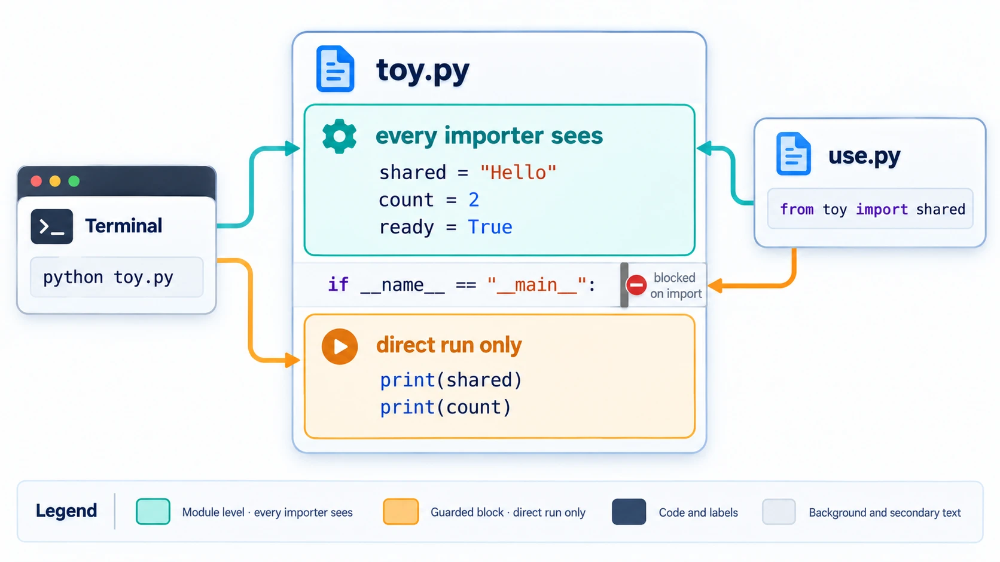
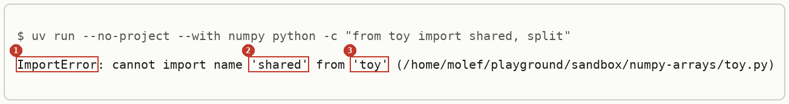
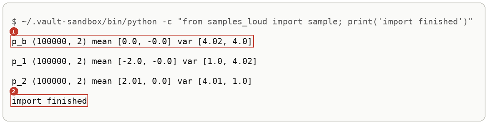
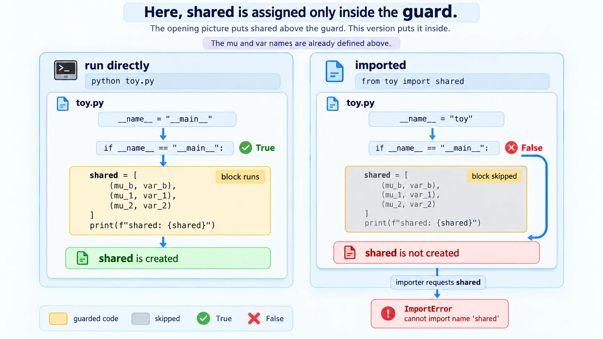
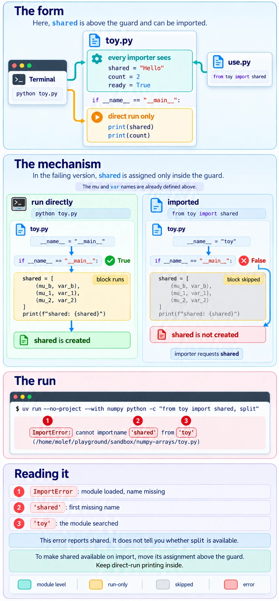

# Modules And Imports

Software, Python. Needs: nothing before it.

> [!question] Test yourself
> [The modules and imports quiz](https://claude.ai/artifact/5NNN1LZqZs1ZTzuNALmazY) covers [[#Names defined under __main__]], step 6 included, in 15 questions. Your attempts are saved on the page.

> [!warning] Unfinished
> - Two pictures for [[#Names defined under __main__]] are being redrawn: the mechanism drew the error straight from the failed `if` test and hid the name lookup between them, and the deep-dive sheet's field cards ran in the reverse order of its markers. The current pictures stay until the new ones land. Their prompts are in the vault's `.prompts/Modules And Imports.md`.
> - The quiz page does not yet cover step 6, the print loop that runs on import.
> - No project has applied this yet. Every run below is a sandbox run.
>
> Stated, not checked: 2 claims, each marked where it sits.

**Every `.py` file is a module, and `import` runs it to collect the names it defines.** This note shows the one line that decides which names another file can see, using a file that defines three Gaussians and a second file that wants them. The sandbox is one empty folder.

**Where you work.**

- Any terminal with Python 3 and `uv`. On the PC, that is Ubuntu under WSL.
- A new empty folder. Nothing here touches a real project.

**Prepare the sandbox.**

```bash
mkdir -p ~/playground/sandbox/numpy-arrays && cd ~/playground/sandbox/numpy-arrays
uv run --no-project --with numpy python -c "import numpy; print(numpy.__version__)"
```

You should see a version number; this run printed `2.4.6`. The setup is shared with [[NumPy#Arrays versus Python lists]], so one folder serves both notes.

## Table of contents

- [[#Names defined under __main__]]

## Names defined under __main__

Navigation: 📋 [[#Table of contents|TOC]]

**Define anything another file will import above `if __name__ == "__main__":`, and keep only what should run on its own below it.** Code under that line runs when you start the file with `python toy.py` and is skipped when another file imports it, so a name assigned there never exists for the importer.

### When to reach for it

A file starts as a script you run, then a second file wants its values: `from toy import shared, split`. If those values were assigned under the `if` line, the import fails with `ImportError`, even though running the file by itself printed them a moment ago.

### The form

```python
# module level: runs on `python toy.py` and on `import toy`
NAME = value

if __name__ == "__main__":
    # runs only on `python toy.py`
    print(NAME)
```

`__name__` is a name Python sets in every module. It holds `"__main__"` in the file you started, and the module's own name (`"toy"`) in a file that was imported.



*The form, a file split by the `if` line into what every importer sees and what only a direct run sees.*
### Try it yourself

**1. Make something to import.** In the sandbox folder, save the learner's `toy.py`, with every name under the `if` line:

```python
import numpy as np 

if __name__ == "__main__":
    mu_b, var_b = ([0,0],[4,4])    
    mu_1, var_1 = ([-2,0],[1,4])    
    mu_2, var_2 = ([2,0],[4,1])    
    mu2s = [0,2]
    shared = [(mu_b, var_b), (mu_1, var_1), (mu_2, var_2)]
    split = [(mu_b, var_b), (mu_1, var_1), (mu2s, var_2)]
    print(f"shared: {shared}")
    print(f"split: {split}")
```

**2. Look at it before.** Run it directly:

```bash
uv run --no-project --with numpy python toy.py
```

```text
shared: [([0, 0], [4, 4]), ([-2, 0], [1, 4]), ([2, 0], [4, 1])]
split: [([0, 0], [4, 4]), ([-2, 0], [1, 4]), ([0, 2], [4, 1])]
```

Run directly, `__name__` is `"__main__"`, so the block runs and the names exist.

**3. The failure.** Import them from another program:

```bash
uv run --no-project --with numpy python -c "from toy import shared, split"
```

You should see the last line of an error:



The same names, asked for as attributes, fail the same way:

```bash
uv run --no-project --with numpy python -c "import toy; print(toy.shared)"
```

```text
AttributeError: module 'toy' has no attribute 'shared'
```

**4. The technique.** Move the assignments above the `if` line and keep only the prints below it. The full file, with arrays, is step 4 of [[NumPy#Try it yourself]]. Then a second file, `use.py`, starting with `from toy import shared`, runs:

```bash
uv run --no-project --with numpy python use.py
```

and its first line reads `shape: (2,) (2,)`, which means `shared` arrived. The full output is read in [[NumPy#Reading the output]].

**5. Another way to get the same answer.** When you cannot edit the file, run it as if it were started directly and take back its names:

```bash
uv run --no-project --with numpy python -c "import runpy; g = runpy.run_path('toy.py', run_name='__main__'); print(g['split'][2])"
```

```text
shared: [([0, 0], [4, 4]), ([-2, 0], [1, 4]), ([0, 2], [4, 1])]
split: [([0, 0], [4, 4]), ([-2, 0], [1, 4]), ([0, 2], [4, 1])]
([0, 2], [4, 1])
```

The first two lines are the file's own prints, since the `if` block ran. The last is the split version's moved expert, read out of the returned names. Use this to inspect someone else's script, never as the way two of your own files share values.

**6. More worked examples: the opposite slip, a print loop that runs on import.** Leaving a script's run-only code at module level makes every importer run it. In the walk's step 3c, `noised.py` imported `sample` from `samples.py`, and the import printed the three clouds' lines before `noised.py` did any work. Save this beside the fixed `toy.py` of step 4 as `samples_loud.py`, with its loop at module level:

```python
import numpy as np
from toy import shared

rng = np.random.default_rng(0)
N = 100_000

def sample(mu, var, n):
    return mu + np.sqrt(var) * rng.standard_normal((n, len(mu)))

for name, (mu, var) in zip(["p_b", "p_1", "p_2"], shared):
    x = sample(mu, var, N)
    print(name, x.shape, "mean", np.round(x.mean(0), 2).tolist(), "var", np.round(x.var(0), 2).tolist())
```

```bash
~/.vault-sandbox/bin/python -c "from samples_loud import sample; print('import finished')"
```

You should see:



Marker 1 is the loop, which ran during the import and drew 300,000 points (600,000 random numbers) nobody asked for. Marker 2 is the importer's own line, printed only afterwards. Put the loop under `if __name__ == "__main__":`, as `samples.py` does in [[Multivariate Normal Distribution#Try sampling yourself]] step 5, and the same import prints only `import finished`. The prepared environment `~/.vault-sandbox/bin/python` is set up as in that note's steps 1 and 2.

**7. Clean up, and prove it.**

```bash
cd ~ && rm -r ~/playground/sandbox/numpy-arrays
ls ~/playground/sandbox/numpy-arrays; echo $?
```

You should see `No such file or directory`, then `2`.

### Reading the output

| # | Field | This run | How to read it | Backing |
|---|---|---|---|---|
| 1 | error class | `ImportError` | the module loaded, but the name you asked for is not in it | shown |
| 2 | the name | `'shared'` | the first name in the `from ... import` list that was missing; Python stops at it, so `split` is never checked | shown for the name; stated for the stopping |
| 3 | the module | `'toy'` | which module was searched, followed by the file it came from | shown |

### How it works

Nothing here follows from numbers. The mechanism takes four steps, and each shows in a run above.

1. `python toy.py` sets `__name__` to `"__main__"` in `toy.py`, the test passes, and the block runs. Step 2 shows its prints.
2. `from toy import shared` runs `toy.py` top to bottom with `__name__` set to `"toy"`. The test fails, so the block is skipped. Step 3 shows no prints before the error.
3. Python then looks up `shared` among the names the run left behind. Only `np` was assigned at module level, so the lookup fails with `ImportError`. Step 3 shows it.
4. With the assignments moved above the `if` line, step 2 of the import creates them, and the lookup succeeds. Step 4 shows `use.py` getting `shared`.



*The mechanism, the same file run two ways with the `if` line letting one through and stopping the other.*


*The deep-dive sheet composing the form, the mechanism and the run.*
### Other ways

- Put shared values in their own module (`gaussians.py`) with no `if` block at all, and import it from both the script and every later file.
- `runpy.run_path(..., run_name="__main__")` for a file you cannot edit, as in step 5.
- A `def main():` called from under the `if` line keeps the run-only code in a function. This is the layout the Python documentation recommends. *Stated:* the page linked in the sources shows it, but no run here uses it.

### Why this matters

A walk builds one small file per step, and every later step imports the earlier ones. A name trapped under `__main__` breaks the next step with an error that points at the importer, not at the file that hid it.

### Taught in, applied in

**Taught in:**

- the `drip-read` walk of [the Mechanisms of Projective Composition paper note](../../deep-learning/01-poe-derivation-foundations/papers/mechanisms-of-projective-composition/), step 1 of 3 up to the object, where the walk's second correction moved `shared` and `split` above the `if` line so `from toy import shared, split` works in the next step

- the same walk's step 3c, where importing `sample` from the learner's `samples.py` ran its print loop, and the walk's fix was to put the loop under `if __name__ == "__main__":`

**Applied in:** nothing yet.

**Before this note:** the learner's LibreOffice note `Software/Python/Python.odt` uses `if __name__ == "__main__":` in several examples without explaining what it hides from an importer.

> [!note]- How this was checked
> Every output in steps 1 to 5 was run by the writer in an empty folder, `~/playground/sandbox/numpy-arrays`, on the PC: Ubuntu under WSL2, Python 3.12.3, NumPy 2.4.6 through uv 0.8.13, on 2026-10-04. The folder was removed afterwards and the clean-up check returned 2.
>
> The `toy.py` in step 1 is the learner's own file, copied byte for byte from the walk, and its direct-run output matched the learner's.
>
> The worked example in step 6 was run by the writer in `~/playground/sandbox/gaussian-clouds` on the same PC through the prepared environment `~/.vault-sandbox/bin/python` (Python 3.11.13, NumPy 2.4.6) on 2026-10-04, once with the learner's `toy.py` and once with the array `toy.py` of [[NumPy#Try it yourself]] step 4, which printed the same lines. With the loop under the `if` line, the same import printed only `import finished`. The folder was removed afterwards.
>
> Both output pictures were rendered from the captured text by a script in DejaVu Sans Mono, never drawn.
>
> References, each link checked on 2026-10-04 and answering 200: [__main__: Top-level code environment](https://docs.python.org/3/library/__main__.html), [the modules tutorial](https://docs.python.org/3/tutorial/modules.html). The Python documentation is under the PSF licence. No tldr-pages entry covers this.
