# NumPy

Software, Python. Needs: [[Modules And Imports]] for how a second file gets at the arrays you define.

> [!question] Test yourself
> [The NumPy quiz](https://claude.ai/artifact/Lh1wvXBiirkRyDvn76yZKR) covers [[#Arrays versus Python lists]], [[#Broadcasting]] and [[#Random numbers from a seeded generator]] in 19 questions. Your attempts are saved on the page.

> [!warning] Unfinished
> - Two pictures for [[#Arrays versus Python lists]] are being redrawn: the mechanism fed both array cells into the plus signs from the whole block, so no entry could be followed into its own sum, and the deep-dive sheet's output and field cards were too small to read at note width. The current pictures stay until the new ones land. Their prompts are in the vault's `.prompts/NumPy.md`.
> - Six pictures are still to be drawn: the form, the mechanism and the deep-dive sheet for [[#Broadcasting]] and for [[#Random numbers from a seeded generator]]. Their prompts are in the same file.
> - The quiz page covers [[#Arrays versus Python lists]] only. The two newer sections are owed to it.
> - No project has applied this yet. Every run below is a sandbox run.
>
> Stated, not checked: 2 claims, each marked where it sits.

**NumPy gives Python an array: a block of numbers of one type that arithmetic acts on number by number.** This note shows why a plain Python list cannot do that job, then does the same arithmetic with arrays on three small Gaussians. The sandbox is one empty folder.

**Where you work.**

- Any terminal with Python 3 and `uv`. On the PC, that is Ubuntu under WSL.
- A new empty folder. Nothing here touches a real project.

**Prepare the sandbox.** Make the folder and check NumPy loads.

```bash
mkdir -p ~/playground/sandbox/numpy-arrays && cd ~/playground/sandbox/numpy-arrays
uv run --no-project --with numpy python -c "import numpy; print(numpy.__version__)"
```

You should see a version number. This run printed `2.4.6`. Any NumPy 1.x or 2.x behaves the same here.

If `uv` is missing, install it from [the uv installation page](https://docs.astral.sh/uv/getting-started/installation/), or use a virtual environment with `pip install numpy` and drop the `uv run --no-project --with numpy` prefix from every command below.

## Table of contents

- [[#Arrays versus Python lists]]
- [[#Broadcasting]]
- [[#Random numbers from a seeded generator]]

## Arrays versus Python lists

Navigation: 📋 [[#Table of contents|TOC]] | [[#Broadcasting]] ➡️

**Wrap numbers in `np.array` before doing arithmetic on them, because a Python list treats `+` as joining and refuses `/` altogether.** A list `[1, 4]` written in a NumPy file is still a list. Importing NumPy changes nothing until you call `np.array`.

### When to reach for it

Any time a formula acts on every coordinate at once: one over a variance, a mean divided by a variance, a sum across experts. Without arrays, division fails with a `TypeError`, and addition does something worse: it succeeds and returns a longer list.

### The form

```text
np.array(<list of numbers>)              an array of shape (n,), its type read from the numbers
np.array(<list of numbers>, dtype=float) the same, forced to floating point
<array> + <array>                        added coordinate by coordinate, shapes must match
<number> / <array>                       the number divided by each coordinate
```

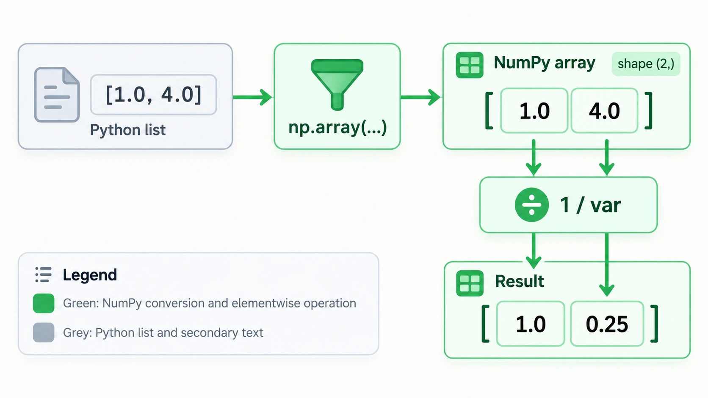

*The form, with the list going in, the shape `(2,)` and the arithmetic acting per coordinate.*
### np.array

**`np.array` turns a list of numbers into an array whose arithmetic acts on each number.** Written `np.array([1.0, 4.0])`, it holds two floats and has shape `(2,)`. Write the numbers with a decimal point (`4.0`, not `4`), so a later division never surprises you with an integer type. NumPy's `/` returns floats even on integer arrays, as step 5's third line shows, so this is a habit for readability rather than a fix.

### Try it yourself

**1. Make something to act on.** In the sandbox folder, save this as `toy.py`. It stores three two-dimensional Gaussians as (mean, variance) pairs, the [[Multivariate Normal Distribution#Diagonal Gaussian|diagonal Gaussian]] form, using plain lists:

```python
import numpy as np 

if __name__ == "__main__":
    mu_b, var_b = ([0,0],[4,4])    
    mu_1, var_1 = ([-2,0],[1,4])    
    mu_2, var_2 = ([2,0],[4,1])    
    mu2s = [0,2]
    shared = [(mu_b, var_b), (mu_1, var_1), (mu_2, var_2)]
    split = [(mu_b, var_b), (mu_1, var_1), (mu2s, var_2)]
    print(f"shared: {shared}")
    print(f"split: {split}")
```

**2. Look at it before.**

```bash
uv run --no-project --with numpy python toy.py
```

You should see:

```text
shared: [([0, 0], [4, 4]), ([-2, 0], [1, 4]), ([2, 0], [4, 1])]
split: [([0, 0], [4, 4]), ([-2, 0], [1, 4]), ([0, 2], [4, 1])]
```

The values are right. Nothing in this output says they are lists rather than arrays, which is why the problem hides until the arithmetic.

**3. The failure without arrays.** Do the three operations the next step needs, on plain lists:

```bash
uv run --no-project --with numpy python -c "print(1 / [1, 4])"
uv run --no-project --with numpy python -c "print([1, 4] + [4, 1])"
uv run --no-project --with numpy python -c "print(2 * [1, 4])"
```

You should see the last line of an error, then two lists:

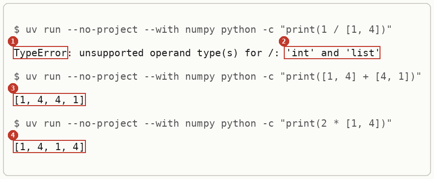

**4. The technique.** Rewrite `toy.py` with every list wrapped in `np.array`, the names above the `if` line so another file can import them (why is in [[Modules And Imports#Names defined under __main__]]):

```python
import numpy as np

mu_b, var_b = np.array([0.0, 0.0]), np.array([4.0, 4.0])
mu_1, var_1 = np.array([-2.0, 0.0]), np.array([1.0, 4.0])
mu_2, var_2 = np.array([2.0, 0.0]), np.array([4.0, 1.0])
mu_2s = np.array([0.0, 2.0])
shared = [(mu_b, var_b), (mu_1, var_1), (mu_2, var_2)]
split = [(mu_b, var_b), (mu_1, var_1), (mu_2s, var_2)]

if __name__ == "__main__":
    print(f"shared: {shared}")
    print(f"split: {split}")
```

Then save this as `use.py`. It multiplies the two experts' Gaussians, which for diagonal Gaussians means adding one-over-variance coordinate by coordinate, and then divides out the background:

```python
from toy import shared

(mu_b, var_b), (mu_1, var_1), (mu_2, var_2) = shared
print("shape:", mu_1.shape, var_1.shape)
print("1/var_1:", 1 / var_1)
prec = 1 / var_1 + 1 / var_2
var = 1 / prec
mu = var * (mu_1 / var_1 + mu_2 / var_2)
print("two experts:  mean", mu, " var", var)
prec3 = 1 / var_1 + 1 / var_2 - 1 / var_b
var3 = 1 / prec3
mu3 = var3 * (mu_1 / var_1 + mu_2 / var_2 - mu_b / var_b)
print("with p_b:     mean", mu3, " var", var3)
```

```bash
uv run --no-project --with numpy python use.py
```

You should see:

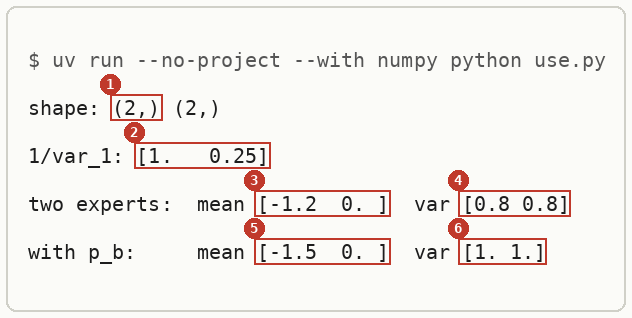

**5. Another way to get the same answer.** `np.asarray` does the same wrapping and skips the copy when its input is already an array:

```bash
uv run --no-project --with numpy python -c "import numpy as np; print(np.asarray([1, 4]) + np.asarray([4, 1])); print(np.array([1, 4]).dtype, np.array([1.0, 4.0]).dtype); print(1 / np.array([1, 4]))"
```

```text
[5 5]
int64 float64
[1.   0.25]
```

The first line is the `+` that joined the lists in step 3, now adding. The second shows the type each spelling gets. The third shows integer arrays still divide to floats.

**6. Clean up, and prove it.**

```bash
cd ~ && rm -r ~/playground/sandbox/numpy-arrays
ls ~/playground/sandbox/numpy-arrays; echo $?
```

You should see `No such file or directory`, then `2`.

### Reading the output

The lists, from step 3:

| # | Field | This run | How to read it | Backing |
|---|---|---|---|---|
| 1 | error class | `TypeError` | Python has no rule for this operator on these two types | shown |
| 2 | operand types | `'int' and 'list'` | the left side is the number 1, the right side the list; a list has no `/` | shown |
| 3 | `[1, 4] + [4, 1]` | `[1, 4, 4, 1]` | `+` on lists joins them end to end, so a precision sum silently becomes a length-4 list | shown |
| 4 | `2 * [1, 4]` | `[1, 4, 1, 4]` | `*` by a whole number repeats the list | shown |

The arrays, from step 4:

| # | Field | This run | How to read it | Backing |
|---|---|---|---|---|
| 1 | shape | `(2,)` | one axis with two entries: one number per coordinate | shown |
| 2 | `1/var_1` | `[1.   0.25]` | one over each variance, 1/1 and 1/4; NumPy pads the columns to line up | shown |
| 3 | two experts, mean | `[-1.2  0. ]` | the composed mean; matches plan 13's (-1.2, 0) | shown |
| 4 | two experts, var | `[0.8 0.8]` | 1/(1/1 + 1/4) = 0.8 and 1/(1/4 + 1/1) = 0.8 | derived below |
| 5 | with background, mean | `[-1.5  0. ]` | the mean once the background's 1/4 is taken away; matches plan 13's (-1.5, 0) | shown |
| 6 | with background, var | `[1. 1.]` | 1/(1.25 - 0.25) = 1 on each coordinate | derived below |

### How it works

The numbers in step 4 follow from adding precisions, one coordinate at a time.

$$
\begin{aligned}
\tfrac{1}{\sigma^2} &= \tfrac{1}{\sigma_1^2} + \tfrac{1}{\sigma_2^2} \\
\text{coordinate 1: } &= \tfrac{1}{1} + \tfrac{1}{4} = 1.25, \quad \sigma^2 = 0.8 \\
\text{coordinate 2: } &= \tfrac{1}{4} + \tfrac{1}{1} = 1.25, \quad \sigma^2 = 0.8 \\
\mu^{(1)} &= \sigma^2 \left( \tfrac{-2}{1} + \tfrac{2}{4} \right) = 0.8 \times (-1.5) = -1.2
\end{aligned}
$$

With the background divided out, the precision on each coordinate is $1.25 - 0.25 = 1$, so $\sigma^2 = 1$ and $\mu^{(1)} = 1 \times (-2 + 0.5 - 0) = -1.5$.

The mechanism behind the arrays, in three steps:

1. `np.array([1.0, 4.0])` stores two floats in one block with shape `(2,)`. Step 4's first line shows the shape.
2. An operator between an array and a number, or two arrays of the same shape, runs once per entry. Step 4's `1/var_1` shows it.
3. A list has its own operators: `+` joins and `*` repeats, and there is no `/`. Step 3 shows all three.

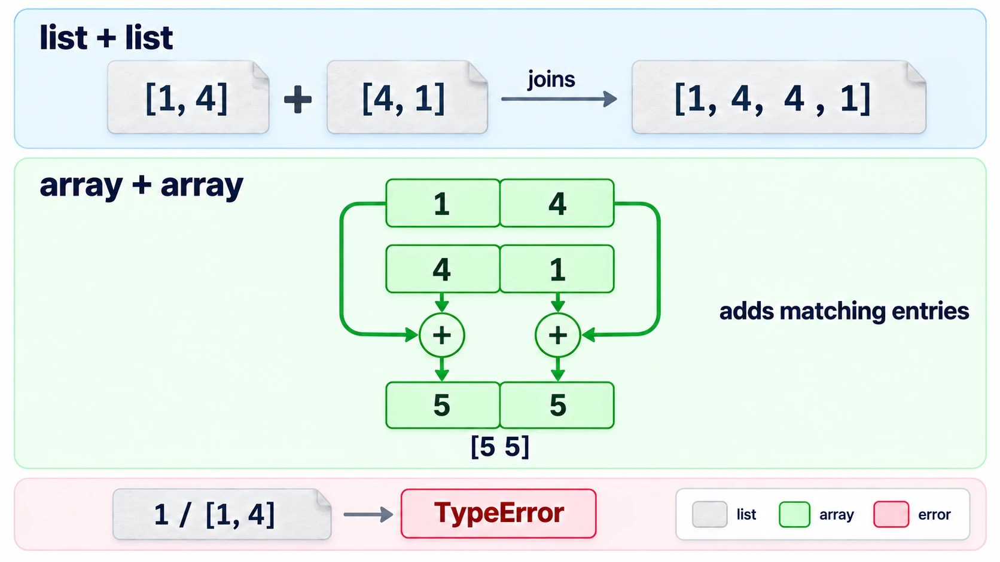

*The mechanism, a list joining end to end beside an array adding entry by entry.*
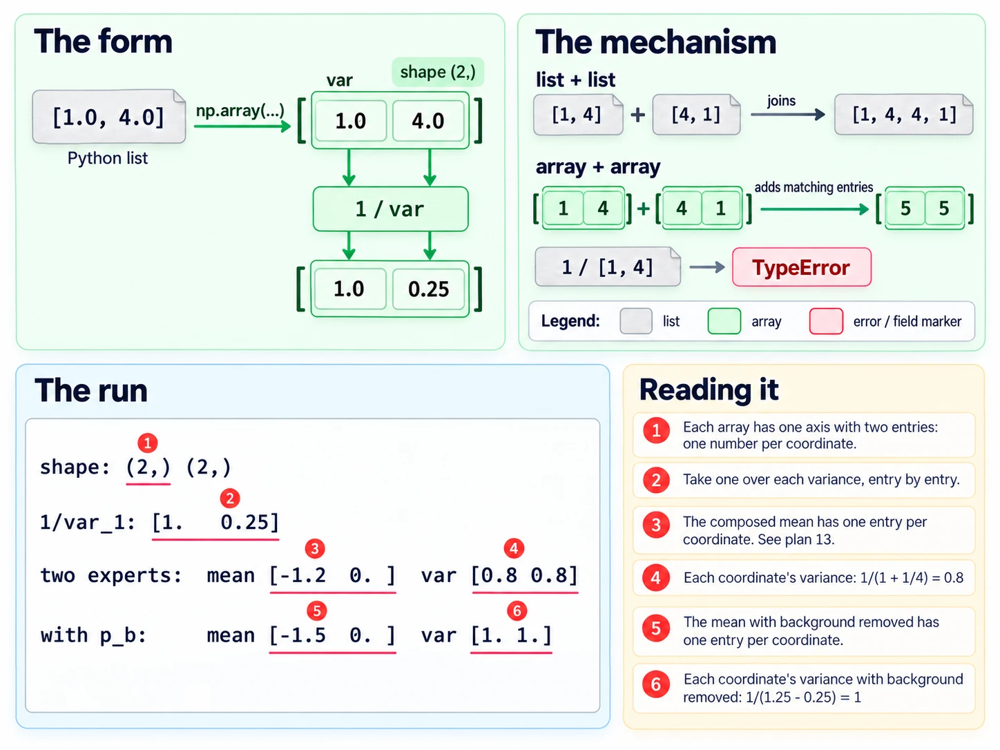

*The deep-dive sheet composing the form, the mechanism and the run.*
### Other ways

- `np.asarray(x)` when `x` may already be an array and you want no copy.
- `np.array(x, dtype=float)` when the numbers come in as whole numbers and you want floats from the start.
- A list comprehension, `[1 / v for v in var_1]`, works for one line of arithmetic and stops being readable by the second.
- JAX's `jnp.array` behaves the same way for this arithmetic. *Stated.*

### Why this matters

Every Gaussian formula with a diagonal covariance is per-coordinate arithmetic. A list silently turns the precision sum into a longer list, and the error appears two lines later, somewhere that looks unrelated.

### Taught in, applied in

**Taught in:**

- the `drip-read` walk of [the Mechanisms of Projective Composition paper note](../../deep-learning/01-poe-derivation-foundations/papers/mechanisms-of-projective-composition/), step 1 of 3 up to the object, where the learner's lists matched the answer key and were then wrapped in `np.array`
- the PoE derivation foundations journey's plan 13, `plans/13-poe-on-two-gaussians.md`, lines 147 to 153 and 173 to 175, which compute these same composed means and variances

**Applied in:** nothing yet.

**Before this note:** the learner's LibreOffice note `Software/Python/Libraries/Numpy/Numpy.odt` covers `hstack`, `meshgrid` and `linspace`, not lists against arrays.

## Broadcasting

Navigation: ⬅️ [[#Arrays versus Python lists]] | 📋 [[#Table of contents|TOC]] | [[#Random numbers from a seeded generator]] ➡️

**Broadcasting lets a smaller array act on a bigger one with no loop: a `(2,)` array is reused for every row of an `(n, 2)` matrix, and a `(3, 1, 1)` array applies each of its three numbers to the whole `(n, 2)` matrix, giving `(3, n, 2)`.** NumPy lines the two shapes up from the right. Each pair of lengths must be equal, or one of them must be 1, and a missing length counts as 1.

### When to reach for broadcasting

When one small set of numbers applies to every row of a big array: a mean and a standard deviation applied to $n$ random points, as in [[Multivariate Normal Distribution#Sampling a diagonal Gaussian]], or several noise levels applied to one whole cloud, as in [[Diffusion Models#The forward process in one jump]]. Without it you write a loop over rows or levels. When the shapes do not line up, NumPy stops with a `ValueError` that names both shapes, and the fix is to give the small array length-1 axes in the right places.

### The form of a broadcast

```text
(n, 2) <op> (2,)         -> (n, 2)      the (2,) row is reused for each of the n rows
(3, 1, 1) <op> (n, 2)    -> (3, n, 2)   each of the 3 numbers multiplies the whole (n, 2) matrix
<arr>[:, None, None]                    a (3,) array seen as (3, 1, 1): two new axes of length 1
```

`None` inside the brackets is NumPy's `np.newaxis`: it adds an axis of length 1 at that place.

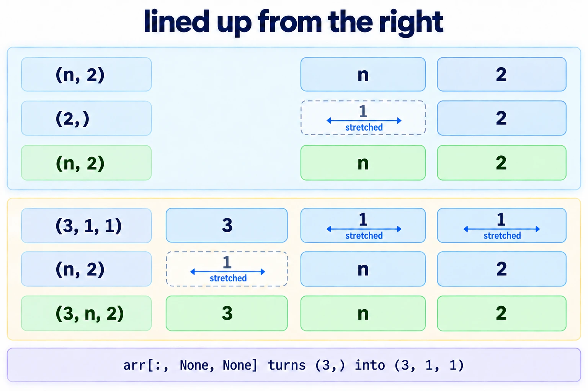

*The form, two shapes written one above the other and lined up from the right, with the length-1 axes stretching.*

### Try broadcasting yourself

**1. What you need, and when it is missing.** Python with NumPy. The commands below use the prepared environment `~/.vault-sandbox/bin/python`; [[Multivariate Normal Distribution#Try sampling yourself]] steps 1 and 2 say how to check it and what to do when it is missing.

**2. Make something to act on.**

```bash
mkdir -p ~/playground/sandbox/gaussian-clouds && cd ~/playground/sandbox/gaussian-clouds
```

**3. The failure: three noise levels against a cloud, with no length-1 axes.** Save this as `mismatch.py`:

```python
import numpy as np

abar = np.array([1.0, 0.5, 0.0058])
x0 = np.zeros((100_000, 2))
xt = np.sqrt(abar) * x0
```

```bash
~/.vault-sandbox/bin/python mismatch.py
```

You should see the last line of an error:

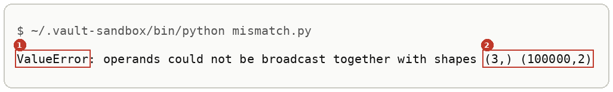

Lined up from the right, the `3` of `abar` meets the `2` of `x0`. They differ and neither is 1, so NumPy stops.

**4. The technique.** Save this as `shapes.py`. It applies a `(2,)` mean and standard deviation to five random points, then three noise levels to the result:

```python
import numpy as np

rng = np.random.default_rng(0)
mu, var = np.array([-2.0, 0.0]), np.array([1.0, 4.0])
eps = rng.standard_normal((5, 2))
x = mu + np.sqrt(var) * eps
print("mu", mu.shape, "eps", eps.shape, "x", x.shape)
print("row 0: eps", eps[0].round(3), "-> x", x[0].round(3))

abar = np.array([1.0, 0.5, 0.0058])
a = abar[:, None, None]
print("abar", abar.shape, "a", a.shape, "a * x", (a * x).shape)
```

```bash
~/.vault-sandbox/bin/python shapes.py
```

You should see:

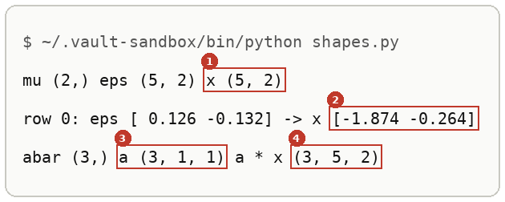

**5. Other ways to get the same answer.** `reshape(3, 1, 1)` and `np.newaxis` give the same `(3, 1, 1)`, and a loop stacked into one array gives the same result shape:

```bash
~/.vault-sandbox/bin/python -c "import numpy as np; abar = np.array([1.0, 0.5, 0.0058]); x0 = np.ones((100_000, 2)); print(np.stack([np.sqrt(a) * x0 for a in abar]).shape, (np.sqrt(abar.reshape(3, 1, 1)) * x0).shape, (np.sqrt(abar[:, np.newaxis, np.newaxis]) * x0).shape)"
```

```text
(3, 100000, 2) (3, 100000, 2) (3, 100000, 2)
```

**6. Clean up, and prove it.**

```bash
cd ~ && rm -r ~/playground/sandbox/gaussian-clouds
ls ~/playground/sandbox/gaussian-clouds; echo $?
```

You should see `No such file or directory`, then `2`.

### Reading the broadcast output

From step 4:

| # | Field | This run | How to read it | Backing |
|---|---|---|---|---|
| 1 | `x` shape | `(5, 2)` | the `(2,)` mean and standard deviation reached all five rows | shown |
| 2 | row 0 of `x` | `[-1.874 -0.264]` | row 0 of `eps`, `[0.126 -0.132]`, shifted by `mu` and stretched by `[1, 2]` | derived below |
| 3 | `a` shape | `(3, 1, 1)` | `abar` with two length-1 axes added after its 3 | shown |
| 4 | `a * x` shape | `(3, 5, 2)` | one `(5, 2)` cloud per noise level | derived below |

From step 3, the error names the two shapes it could not line up, `(3,)` and `(100000,2)`, in the order they appeared in the expression.

### How broadcasting works

Write the shapes one above the other, aligned on the right, and fill missing places with 1:

```text
x0:            100000   2         ->   (1, 100000, 2)
a:          3       1   1         ->   (3,      1, 1)
result:     3  100000   2
```

In each column the lengths are equal, or one of them is 1 and is stretched to the other. In step 3, `abar` had shape `(3,)`, so its 3 sat under the 2 and the rule failed. *Cited:* the NumPy broadcasting page in the sources.

The worked numbers for row 0 of step 4, with $\sqrt{\text{var}} = (1, 2)$:

$$
\begin{aligned}
x^{(1)} &= -2 + 1 \times 0.126 = -1.874 \\
x^{(2)} &= 0 + 2 \times (-0.132) = -0.264
\end{aligned}
$$

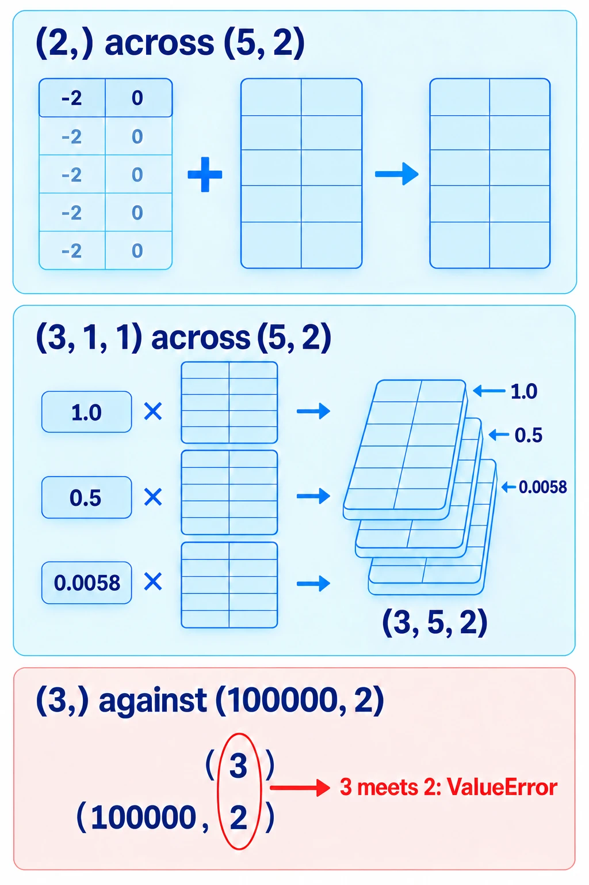

*The mechanism, the `(2,)` row copied down five rows, and the `(3, 1, 1)` column copied across a whole cloud three times.*

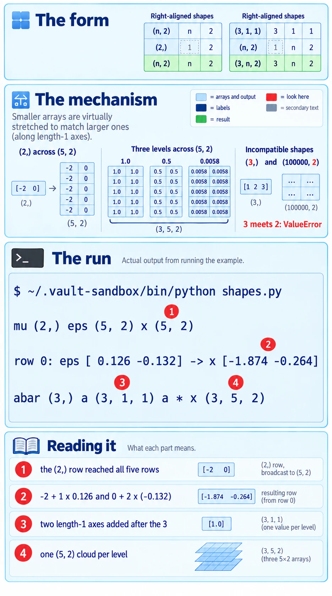

*The deep-dive sheet composing the form, the mechanism and the run.*

### Other ways to broadcast

- `arr.reshape(3, 1, 1)`, when the new shape is easier to read written out in full.
- `arr[:, np.newaxis, np.newaxis]`, the spelled-out name for `None`.
- A loop over levels with `np.stack`, when each level needs different code. It gives the same result shape and is slower for many levels. *Stated:* the speed was not timed here.

### Why broadcasting matters

The diffusion forward process noises a whole cloud at several levels in one line, and sampling stretches every point in one line. Both lines rely on shapes lining up from the right, and the `ValueError` of step 3 is what you see when they do not.

### Broadcasting taught in, applied in

**Taught in:**

- the `drip-read` walk of [the Mechanisms of Projective Composition paper note](../../deep-learning/01-poe-derivation-foundations/papers/mechanisms-of-projective-composition/), step 2, where `mu` of shape `(2,)` broadcast across the `(n, 2)` matrix of draws, and step 3c, where `abar` reshaped to `(3, 1, 1)` made a `(3, 100000, 2)` tensor

**Applied in:** nothing yet.

## Random numbers from a seeded generator

Navigation: ⬅️ [[#Broadcasting]] | 📋 [[#Table of contents|TOC]]

**Make one generator with `rng = np.random.default_rng(seed)` and draw every random number from it, so the same seed prints the same numbers on every run.** The functions directly under `np.random`, such as `np.random.standard_normal`, draw from a separate global generator that your `rng` never touches. Seeding `rng` and then calling one of them gives numbers that change on every run.

### np.random.default_rng

**`np.random.default_rng(seed)` returns a `Generator`, NumPy's current random-number object, set to a starting state by `seed`.** Its methods (`standard_normal`, `normal`, `uniform` and the rest) each move it along one stream of numbers. Two generators made with the same seed give the same stream. *Cited:* the NumPy random Generator page in the sources.

### When to reach for a seeded generator

Whenever a printed number will be compared with something: an answer key, a run from yesterday, a check that should fail when the code is wrong. Without a fixed seed, every run prints slightly different numbers, and a real change cannot be told from noise.

### The form of a seeded draw

```text
rng = np.random.default_rng(<seed>)     made once, near the top of the file
rng.standard_normal(<shape>)            draws from rng's stream
rng.normal(<mean>, <std>, <shape>)      the same stream, shifted and scaled
np.random.standard_normal(<shape>)      draws from the hidden global generator; rng is not used
```

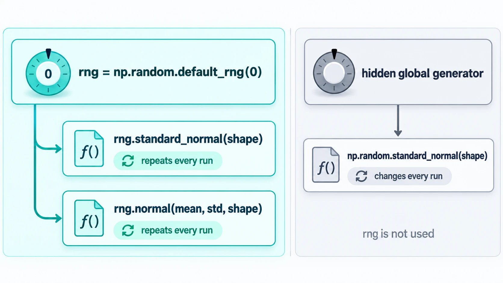

*The form, one seeded generator feeding every draw in a file, beside the hidden global generator that a bare `np.random` call uses.*

### Try seeding yourself

**1. What you need, and when it is missing.** As in [[#Try broadcasting yourself]] step 1.

**2. Make something to act on.** In `~/playground/sandbox/gaussian-clouds`, save the learner's `toy.py` from [[Multivariate Normal Distribution#Try sampling yourself]] step 3.

**3. The failure: a seeded `rng` that is never used.** Save this as `unseeded.py`. It makes `rng` and then draws from `np.random`, the walk's step 2 slip:

```python
import numpy as np
from toy import shared

rng = np.random.default_rng(0)

def sample(mu, var, n):
    return mu + np.sqrt(var) * np.random.standard_normal((n, len(mu)))

mu, var = shared[1]
x = sample(mu, var, 100_000)
print("p_1 var", np.round(x.var(0), 4).tolist())
```

Run it twice:

```bash
~/.vault-sandbox/bin/python unseeded.py
~/.vault-sandbox/bin/python unseeded.py
```

You should see two different lines:

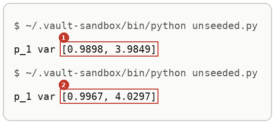

Your numbers will differ from these and from each other. That is the failure.

**4. The technique.** Save this as `stream.py`:

```python
import numpy as np

rng = np.random.default_rng(0)
print(type(rng.bit_generator).__name__)
print("first draw: ", rng.standard_normal(3).round(4))
print("second draw:", rng.standard_normal(3).round(4))

fresh = np.random.default_rng(0)
print("fresh rng:  ", fresh.standard_normal(3).round(4))
```

```bash
~/.vault-sandbox/bin/python stream.py
```

You should see:

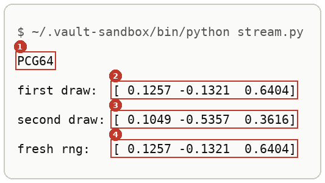

Run it again and the same four lines come back. The first two, `0.1257` and `-0.1321`, are row 0 of `eps` in [[#Try broadcasting yourself]] step 4, because that file also drew first from `default_rng(0)`.

**5. Another way to get the same answer.** The older global seed, `np.random.seed`, also makes runs repeat:

```bash
~/.vault-sandbox/bin/python -c "import numpy as np; np.random.seed(0); print(np.random.standard_normal(3).round(4))"
```

```text
[1.7641 0.4002 0.9787]
```

Run twice, it prints the same line. Its stream differs from `default_rng(0)`'s, and it seeds one generator shared by every module in the program, so a library that also draws from it moves your numbers. NumPy's documentation calls it legacy. *Cited:* the NumPy legacy random page in the sources.

**6. Clean up, and prove it.**

```bash
cd ~ && rm -r ~/playground/sandbox/gaussian-clouds
ls ~/playground/sandbox/gaussian-clouds; echo $?
```

You should see `No such file or directory`, then `2`.

### Reading the seeded output

From step 4:

| # | Field | This run | How to read it | Backing |
|---|---|---|---|---|
| 1 | bit generator | `PCG64` | the algorithm that produces the stream: `default_rng` picks PCG64 | shown |
| 2 | first draw | `[ 0.1257 -0.1321  0.6404]` | the first three standard-normal numbers of seed 0's stream | shown |
| 3 | second draw | `[ 0.1049 -0.5357  0.3616]` | the next three: the generator moved on, so the draws differ | shown |
| 4 | fresh rng | `[ 0.1257 -0.1321  0.6404]` | a new generator with seed 0 starts the stream again: equal to field 2 | shown |

From step 3, the two variance lines differ in the second or third decimal place. Both are within sampling error of `[1, 4]`, which is why the slip is easy to miss: every number looks plausible, and none repeats.

### How seeding works

Nothing here follows from numbers. The mechanism takes four steps, each shown above.

1. `np.random.default_rng(0)` builds a PCG64 generator whose internal state is set from the seed 0. Step 4's first line names it.
2. Each call such as `rng.standard_normal(3)` reads the next numbers from that state and moves it forward. Step 4's second and third lines differ.
3. A second generator built from the same seed starts from the same state. Step 4's last line repeats the first draw.
4. `np.random.standard_normal` reads from a separate global generator, seeded unpredictably when NumPy loads unless `np.random.seed` is called. Step 3's two runs differ even though `rng` was seeded. *Cited:* the NumPy legacy random page in the sources.

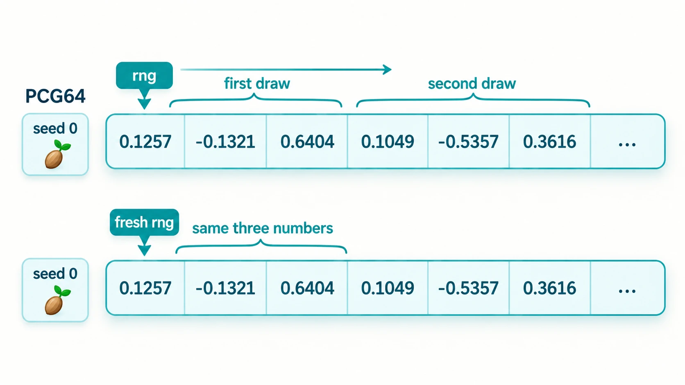

*The mechanism, the seed setting a state, each draw reading the next numbers and moving the state on, and a second generator replaying the stream.*

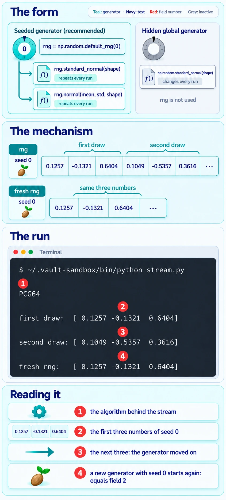

*The deep-dive sheet composing the form, the mechanism and the run.*

### Other ways to seed

- `np.random.seed(0)` with the `np.random` functions, in older code. It repeats, as step 5 shows, and every library in the program shares it.
- Passing a generator into a function, `def sample(mu, var, n, rng):`, when several files must draw from one stream. The walk's `noised.py` imports `rng` from `samples.py` for the same reason.
- `random_state=0` on SciPy's `rvs` methods, which seeds SciPy's draw; see [[Multivariate Normal Distribution#Try sampling yourself]] step 6.

### Why seeding matters

A walk's answer key is a run at seed 0. A learner's file that draws from the unseeded global generator can never match it digit for digit, so every comparison becomes "close enough", and a real mistake hides inside the noise.

### Seeding taught in, applied in

**Taught in:**

- the `drip-read` walk of [the Mechanisms of Projective Composition paper note](../../deep-learning/01-poe-derivation-foundations/papers/mechanisms-of-projective-composition/), step 2, where the learner's `samples.py` made `rng = np.random.default_rng(0)` and drew from `np.random.standard_normal`, and the walk's correction was to draw from `rng`

**Applied in:** nothing yet.

> [!note]- How this was checked
> Every output in [[#Arrays versus Python lists]] was run by the writer in an empty folder, `~/playground/sandbox/numpy-arrays`, on the PC: Ubuntu under WSL2, Python 3.12.3, NumPy 2.4.6 through uv 0.8.13, on 2026-10-04. The folder was removed afterwards and the check in step 6 returned 2.
>
> The list-based `toy.py` is the learner's own file, copied byte for byte from the walk, and its output matched the learner's run exactly. The array values match the walk's answer key, `checks/toy.py` in the paper's folder under the journey's `sources/mechanisms-of-projective-composition/`.
>
> Every output in [[#Broadcasting]] and [[#Random numbers from a seeded generator]] was run by the writer in an empty folder, `~/playground/sandbox/gaussian-clouds`, on the PC: Ubuntu under WSL2, through the prepared environment `~/.vault-sandbox/bin/python` (Python 3.11.13, NumPy 2.4.6), on 2026-10-04. `stream.py` was run twice and printed identical output both times; `np.random.seed(0)` was run twice and printed `[1.7641 0.4002 0.9787]` both times. The folder was removed afterwards and the clean-up check returned 2.
>
> `unseeded.py` reproduces the walk's step 2 slip in the learner's own `samples.py`, which made `rng` and drew from `np.random.standard_normal`; the learner's file is quoted in its sampler line and import, with the print reduced to one cloud.
>
> The six output pictures were rendered from the captured text by a script in DejaVu Sans Mono, never drawn.
>
> References, each link checked on 2026-10-04 and answering 200: [numpy.array](https://numpy.org/doc/stable/reference/generated/numpy.array.html), [the absolute basics](https://numpy.org/doc/stable/user/absolute_beginners.html), [broadcasting](https://numpy.org/doc/stable/user/basics.broadcasting.html), [Random Generator](https://numpy.org/doc/stable/reference/random/generator.html), [Legacy random generation](https://numpy.org/doc/stable/reference/random/legacy.html), [Generator.standard_normal](https://numpy.org/doc/stable/reference/random/generated/numpy.random.Generator.standard_normal.html). NumPy's documentation is under the BSD 3-Clause licence. No tldr-pages entry exists for NumPy.
