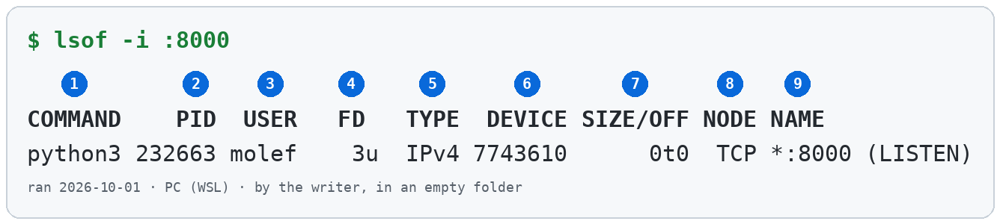
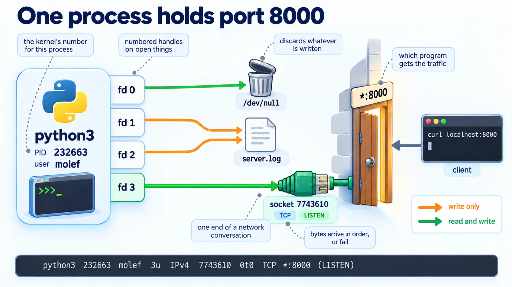

# Linux

Information Technology, Operating Systems. Needs: [[Intro To Networking]] for what a network connection is.

> [!question] Test yourself: quiz not built yet
> One quiz covers this whole note. Its link appears here once the page is published.

> [!warning] Unfinished
> - Two pictures are still to be drawn: the kernel between the hardware and the programs, and the form of `lsof -i`.
> - No project has applied `lsof` yet. Every run below is a sandbox run.
>
> Stated, not checked: 6 claims, each marked where it sits.

**Linux runs programs and hands each one what it opens.** This note explains how Linux keeps track of what each program has open, then uses `lsof` to read that list for one port. The sandbox is two terminal windows and an empty folder.

**Where you work.**

- Any Linux or Mac terminal. On the PC, that is Ubuntu under WSL.
- A new empty folder. Nothing here touches a real project.

**Prepare the sandbox.** Make the folder and check the two tools are there.

```bash
mkdir -p ~/playground/sandbox/lsof && cd ~/playground/sandbox/lsof
python3 --version
lsof -v 2>&1 | grep revision
```

You should see:

```text
Python 3.12.3
    revision: 4.95.0
```

Your version numbers may differ. Any `lsof` revision 4 behaves the same here.

## Table of contents

- [[#What Linux is]]
- [[#Everything is opened the same way]]
- [[#lsof]]

## What Linux is

Navigation: 📋 [[#Table of contents|TOC]] | [[#Everything is opened the same way]] ➡️

**Linux is an operating system.** It is the program that runs every other program and shares one machine between them. *Stated.*

> 🖼️ **Picture on its way:** the kernel between the hardware and the programs.

### Kernel

**The kernel is the core of Linux.** It owns the memory, the disks and the network, and hands each of them out to programs that ask. The programs you run never touch the hardware themselves. *Stated.*

### Process

**A process is one running copy of a program, with its own number, the PID.** A program is a file on disk. Start it three times and you get three processes, each with a different PID.

The same web server, started three times on 2026-10-01, got PIDs 228372, 230394 and 232663.

To see one process by its number:

```bash
ps -p <PID>
```

### Why this matters

Every tool that inspects or stops a program asks for its PID. `kill`, `ps` and `lsof` all take it.

## Everything is opened the same way

Navigation: ⬅️ [[#What Linux is]] | 📋 [[#Table of contents|TOC]] | [[#lsof]] ➡️

**Linux gives a program a small numbered handle for everything it opens.** A file on disk, a device, a pipe between two programs and a [[Intro To Networking#Network|network]] connection all get the same kind of handle. They are read, written and closed the same way.

### File descriptor

**A file descriptor is the numbered handle a process holds on one open thing.** Numbers 0, 1 and 2 are taken at start, for input, output and errors.

One Python web server held four, read on 2026-10-01:

| Descriptor | Open on | Kind |
|---|---|---|
| 0 | `/dev/null` | a device, `CHR` |
| 1 | `server.log` | a regular file, `REG` |
| 2 | `server.log` | a regular file, `REG` |
| 3 | a network socket | `IPv4` |

### Why this matters

A tool that lists open files lists network connections too, because to Linux they are the same kind of thing. That is the whole reason `lsof` can answer "what is using port 8000".

## lsof

Navigation: ⬅️ [[#Everything is opened the same way]] | 📋 [[#Table of contents|TOC]]

**`lsof` lists the files a program has open, so it shows which program holds a port.** A server will not start because its port is taken, and the error does not say by what. `lsof` names the program, its PID and its owner, so you can decide whether to stop it.

### The form

```text
lsof -i :<port>                   every connection on that port
lsof -i :<port> -sTCP:LISTEN      only the program waiting for connections on it
lsof -t -i :<port> -sTCP:LISTEN   only its PID, ready to hand to kill
```

> 🖼️ **Picture on its way:** the form, with `-i`, `:<port>`, `-sTCP:LISTEN` and `-t` each named.

### Try it yourself

**1. Start something to look at.** In the first terminal, inside the sandbox folder:

```bash
python3 -m http.server 8000
```

**2. Check it answers.** In the second terminal:

```bash
curl -sI localhost:8000 | head -1
```

You should see:

```text
HTTP/1.0 200 OK
```

**3. Try it without `lsof`.** Start a second server on the same port.

```bash
python3 -m http.server 8000
```

You should see the last line of an error:

```text
OSError: [Errno 98] Address already in use
```

The error says the port is taken. It does not say by what.

**4. Ask `lsof`.**

```bash
lsof -i :8000
```

You should see one row:



Your PID and DEVICE numbers will differ. The other seven fields should match.

**5. Clean up, and prove it.** Stop the server by its PID, then ask again.

```bash
kill <PID>
lsof -i :8000; echo $?
```

You should see no rows, then `1`. That means nothing holds the port.

> [!warning] Always run the check again after a stop
> In one run the first `kill` hit the shell that had started the server, and the server kept running. Only the second `lsof` showed it.

### Reading the output

| # | Field | This run | How to read it |
|---|---|---|---|
| 1 | COMMAND | `python3` | the program's name, first nine characters |
| 2 | PID | `232663` | the [[#Process\|process]]'s number, what you hand to `kill` |
| 3 | USER | `molef` | who owns the process |
| 4 | FD | `3u` | [[#File descriptor\|file descriptor]] 3, open for reading and writing: `r` read, `w` write, `u` both |
| 5 | TYPE | `IPv4` | what the descriptor points at: a socket here, `REG` for a file, `CHR` for a device |
| 6 | DEVICE | `7743610` | for a socket, the kernel's number for it |
| 7 | SIZE/OFF | `0t0` | a size or an offset; `0t` marks a decimal offset, meaningless for a waiting socket. *Stated.* |
| 8 | NODE | `TCP` | for a socket, the protocol; for a file, its inode number. *Stated.* |
| 9 | NAME | `*:8000 (LISTEN)` | every network address on this machine, port 8000, waiting for connections |

### With a client connected

**Leave the server running and hold one connection open from a second program.** Then ask again, with and without the filter.

```text
$ lsof -i :8000
COMMAND    PID  USER   FD   TYPE   DEVICE SIZE/OFF NODE NAME
python3 400924 molef    3u  IPv4 13172844      0t0  TCP *:8000 (LISTEN)
python3 400924 molef    4u  IPv4 13172889      0t0  TCP localhost:8000->localhost:59520 (ESTABLISHED)
python3 400944 molef    3u  IPv4 13171404      0t0  TCP localhost:59520->localhost:8000 (ESTABLISHED)

$ lsof -i :8000 -sTCP:LISTEN
COMMAND    PID  USER   FD   TYPE   DEVICE SIZE/OFF NODE NAME
python3 400924 molef    3u  IPv4 13172844      0t0  TCP *:8000 (LISTEN)

$ lsof -t -i :8000 -sTCP:LISTEN
400924
```

**Three rows, two programs.** PID 400924 is the server: one row waiting, one row for the conversation it accepted. PID 400944 is the client, holding the other end. Stopping "whatever `lsof -i :8000` shows" would stop the client as well.

`-sTCP:LISTEN` keeps only the server, and `-t` prints just its PID. That is why every plan that teaches this uses both.

### How it works

Nothing here follows from numbers. The mechanism takes four steps, and each one shows in a run above.

1. The server asks the kernel for a socket on port 8000 and gets file descriptor 3.
2. A second server asks for the same port, and the kernel refuses with `Address already in use`.
3. `lsof` reads every process's open descriptors from the kernel and prints the ones on `:8000`.
4. `kill` ends the process, the kernel closes its descriptors, and the port is free again.



### Other ways

- `ss -ltnp | grep :8000` on Linux gives the same answer from the network side, with the PID inside `users:((...))`.
- `netstat -ano | findstr :8000` on Windows puts the PID in the last column. *Stated.*
- `fuser 8000/tcp` on Linux prints the PID only. *Stated.*

### Why this matters

A port can be held by only one program at a time. A server that will not start, a test that cannot bind, a stale process from yesterday's session all show up the same way, and `lsof -i :<port> -sTCP:LISTEN` names the cause in one line.

### Taught in, applied in

**Taught in**, as `lsof -i :8000 -sTCP:LISTEN`:

- the prototype journey's chapter 0, the environment, line 861
- the prototype journey's chapter 2, design before code, line 947
- the prototype journey's plan 13, line 285, and plan 28, line 199
- the one-business journey's plan 12, line 142, as `lsof -i :8000`

**Applied in:** nothing yet.

> [!note]- How this was checked
> Every output above was run by the writer in an empty folder on the PC: Ubuntu 24.04.2 under WSL, Python 3.12.3, lsof revision 4.95.0. The first run was on 2026-10-01 and the run with a client connected on 2026-10-03.
>
> The FD letters and the COMMAND width are from `man lsof`. The DEVICE number was matched against `/proc/<PID>/fd/3`, which read `socket:[7743610]`.
>
> The picture in [[#How it works]] was drawn by Codex from a prompt checked against this run's values, saved as WebP at quality 90.
